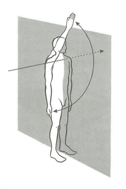
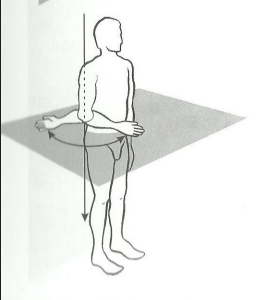
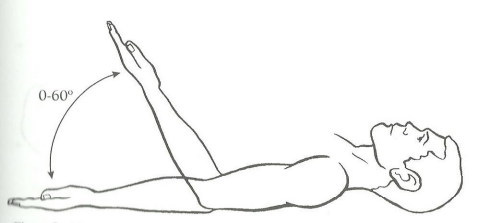
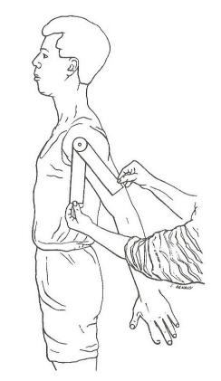

# Avaliação de Indivíduos

A documentação no processo de planejamento fisioterapêutico é essencial. A avaliação inicial e as avaliações durante e ao final do tratamento vão nos permitir fazer comparações, comunicar os resultados a outros profissionais e até mesmo avaliar se o tratamento proposto foi eficaz. É necessário utilizar formas de avaliação padronizadas e um registro cuidadoso dos dados obtidos nessa avaliação.
Um método de avaliação muito utilizado é a goniometria, ou seja, o uso do goniômetro para medir os ângulos articulares do corpo. As medidas goniométricas são usadas pelo fisioterapeuta para quantificar a limitação dos ângulos articulares, decidir a intervenção terapêutica mais apropriada e, ainda, documentar a eficácia desta intervenção.
É provavelmente o procedimento mais utilizado para se fazer avaliação e pode ser considerado como parte essencial de ciência da Fisioterapia.

# Goniometria

O termo goniometria é formado por duas palavras gregas, gonia, que significa ângulo, e metron, que significa medida.
Portanto, goniometria refere-se à medida de ângulos articulares presentes nas articulações dos seres humanos. 
O instrumento mais utilizado para medir a amplitude de movimento é o goniômetro universal.
Os goniômetros universais (assim chamados por Moore, 1949), dada a sua versatilidade, podem ser de plástico ou metal e de diferentes tamanhos, mas com o mesmo padrão básico. Todos têm um corpo e dois braços: um móvel e outro fixo. É no corpo do goniômetro que estão as escalas, podendo ser um círculo completo (0-360 graus) ou de meio círculo (0-180 graus). 
O goniômetro apresenta algumas vantagens: é um instrumento barato, de fácil manuseio e as medidas são tomadas rapidamente.
A precisão da medida é influenciada pela qualidade do goniômetro (por exemplo, hastes longas devem ser mais eficientes para medir ângulos que tenham ossos longos como os da articulação do cotovelo, joelho etc.), pelas diferentes articulações a serem medidas, pelo procedimento utilizado, pelas diferentes patologias (um paciente com muitas limitações articulares e com dor deve ser mais difícil de avaliar do que aquele que tem menos comprometimento) e pela utilização do movimento passivo ou ativo durante a realização da goniometria.
A goniometria é uma importante parte da avaliação das articulações e dos tecidos moles que as envolvem. Uma avaliação completa coоmeça por uma entrevista do indivíduo, a fim de obter informações relevantes sobre história clínica anterior, sintomas, habilidades funcionais, atividades ocupacionais e recreacionais.

Os valores obtidos com a goniometria podem fornecer informações para:

- Determinar a presença ou não de disfunção; 
- Estabelecer um diagnóstico; 
- Estabelecer os objetivos do tratamento; 
- Avaliar o procedimento de melhora ou recuperação funcional; 
- Modificar o tratamento;
- Realizar pesquisas que envolvam a recuperação de limitações articulares; 
- Direcionar a fabricação de órteses.

# Planos e Eixos Utilizados na Goniometria

Os movimentos articulares ocorrem em três planos: sagital, frontal e transverso

- Plano sagital - vai da face anterior à face posterior do corpo e divide o corpo em duas metade, direita e esquerda.
Neste plano ocorrem os movimentos de flexão e extensão.

  
   
  <em>Fig 2: Plano sagital</em>

- Plano frontal - vai de um lado ao outro do corpo, dividindo-o em duas metades, a da frente e a de trás. 
Os movimentos que ocorrem neste plano são a adução e abdução.

  
   
  <em>Fig 3: Plano frontal</em>

- Plano transverso - é horizontal, dividindo o corpo em partes superior e inferior. Neste plano ocorrem os movimentos de rotação.

  
   
  <em>Fig 4: Plano transverso</em>

Observação: Em muitas articulações são possíveis movimentos combinados. Por exemplo, a circundução(flexão-abdução-extensão-adução), mas a goniometria mede apenas os movimentos que ocorrem em um único plano.

# Amplitude de Movimento

Amplitude de movimento (ADM) é a quantidade de movimento de uma articulação. A posição inicial para se medir a amplitude de movimento de todas as articulações, com exceção dos movimentos de rotação, é a posição anatômica.

O que é amplitude de movimento ativa? Refere-se à quantidade de movimento articular realizada por um indivíduo sem qualquer auxílio.
Quando a amplitude é realizada ativamente, o examinador tem a informação exata sobre a capacidade, coordenação e força muscular da amplitude de movimento do indivíduo. Ao testar a ADM ativa, e o indivíduo a completar sem esforço e sem dor, tem-se a noção exata da real condição da amplitude de movimento.

O que é amplitude de movimento passiva? É a quantidade de movimento realizada pelo examinador sem a ajuda do indivíduo. A ADM passiva fornece ao examinador a informação exata sobre a integridade das superfícies articulares e a extensibilidade da cápsula articular, ligamentos e músculos (Norkin, 1997). Ocorrendo dor durante a ADM passiva, ela se deve, muitas vezes, ao movimento de estiramento ou compressão das estruturas não contráteis. A quantidade de ADM passiva é determinada pelo tipo de estrutura da articulação que está sendo testada: cápsulas, ligamentos, tendão ou músculo.

# Expressão Numérica

Moore (1949) fez extensa revisão de literatura sobre a goniometria e descreve diferentes instrumentos e métodos utilizados para avaliar os movimentos articulares, referindo-se em especial à goniometria e salientando a grande confusão que a expressão numérica dos movimentos articulares produziu ao longo dos anos, assim como os diversos métodos propostos para medir os ângulos articulares. Desde a década de 1950, a maioria das escolas de Fisioterapia dos Estados Unidos já adotava a escala de 0-180 graus. De acordo com esse sistema, na postura anatômica ereta, as articulações acham-se a zero grau de movimento. Nesta posição os pés estão em ângulo reto com as pernas, as mãos voltadas para a frente. Assim, o arco de movimento começa em zero grau e vai até um máximo de 180 graus. A exceção fica por conta dos movimentos de rotação.
A definição e o perfeito conhecimento dos valores normais da amplitude de movimento oferecem algumas vantagens, especialmente a base para comparação durante as diferentes fases do tratamento. Neste manual os valores normais apresentados nos Quadros 1, 2 e 3 baseiam-se na proposta a American Academy of North America Surgeons (1965) e The Veterans Administration of United States of North America (1963). Um dos trabaIhos propostos por Marques (1990) que tinha por objetivo ensinar alunos de Fisioterapia a avaliar os ângulos articulares de pacientes reumáticos, mostrou que é possível obter resultados confiáveis a partir do perfeito conhecimento das normas utilizadas para medir os ângulos articulares.

# Registro da Amplitude de Movimento

Ao fazer a goniometria de uma articulação, esta última pode ter movimentos normais, diminuídos ou aumentados. Se estiverem diminuídos chamamos de hipomóveis e se estiverem aumentados chamamos de hipermóveis.
Para se obter informações mais precisas e confiáveis, o registro da amplitude de movimento deve indicar o valor inicial e final. É o chamado arco de movimento. Por exemplo: os 70 graus de flexão do cotovelo podem ser interpretados de várias formas. Uma intepretação possível é que, embora o movimento seja de 70 graus, o arco de movimento é des- conhecido; outra interpretação é concluir que o movimento possível de flexão do cotovelo é de 70 graus, porém sem saber onde ele começa ou termina.
No exemplo anterior, sabendo-se que a amplitude de movimento do braço é de 0-145 graus, é necessário registrar o arco de movimento, ou seja, o início e o final do movimento.

Exemplo: Suponha que a flexão do cotovelo vai de 20-145 graus. Isto significa que há uma limitação de 20 graus na extensão e dizemos que há um flexo de 20 graus. Por outro lado, se a flexão for de 0-115 graus dizemos que a flexão está limitada em 30 graus. Pode ainda haver hipermobilidade (Figura 7).

  
   
  <em>Fig 5: Limitação na flexão do braço. Este indivíduo tem 85 graus de limitação da flexão do braço</em>

  
   
  <em>Fig 6: Limitação na extensão do braço. Este indivíduo tem 20 graus de limitação na extensão do braço</em>

  
   
  <em>Fig 7: Hiperextensão do braço. Este indivíduo tem 10 graus de hiperextensão do braço</em>

# Princípios do Método

- O examinador poderá usar um lápis dermatográfico, para após localizar os pontos anatômicos desejados assinalá-los, e com isso facilitar a realização e a confiabilidade das medidas. O uso do lápis dermatográfico pode ser substituído por etiquetas adesivas.
- Se as roupas do indivíduo interferirem no acesso à palpação dos pontos anatômicos utilizados para direcionar a colocação dos braços fixo e móvel do goniômetro, elas devem ser removidas. O ideal é permanecer com a região a ser avaliada descoberta.
- Para realizar a goniometria, recomenda-se a utilização do movimento passivo, ou seja, o indivíduo realiza o movimento e, nos graus finais, pode receber o auxílio do fisioterapeuta. Também pode ser utilizado o movimento ativo. Chamamos a atenção para o fato de que deve ser usada sempre a mesma metodologia: ou o movimento ativo ou o passivo.
- Antes de iniciar a avaliação, explicar ao paciente de forma clara o movimento que deve realizar e, se necessário, fazer demonstração do mesmo.
- Colocar o paciente num bom alinhamento corporal, o mais próximo possível da postura anatômica. O cuidado com o alinhamento deve ser grande, uma vez que qualquer compensação pode falsear sensivelmente os resultados obtidos.
- Quando o corpo estiver alinhado, ensina-se o paciente a movimentar a articulação em toda a sua amplitude, a fim de localizar, por inspeção, o eixo aproximado do movimento. Se necessário, ajudar o paciente.
- Se o indivíduo tem um lado comprometido e um considerado são, este também deve ser medido para efeito de comparação. Caso os dois lados estejam comprometidos, utilizar para fins de comparação a tabela de ângulos normais.
- As mudanças de posição devem ser programadas para não manipular o paciente excessivamente. Assim, em vez de medir primeiro os membros superiores, depois os membros inferiores e por último a coluna, melhor seria medir tudo oque fosse possível sucessivamente em decúbio dorsal, sentado, em pé etc.
- Os dados devem ser registrados de forma cuidadosa e correta, preferencialmente em um protocolo construído para esta finalidade. O registro deve incluir o nome do avaliador, data e se foi utilizado movimento passivo ou ativo (Ver protocolo no final deste livro).
- De preferência, o mesmo fisioterapeuta deve realizar toda a seqüência de medidas. Este procedimento aumenta a confiabilidade das medidas (Elveru, et al., 1988; Gajdosik e Bohannon, 1987; Riddle e al., 1987).

# 1 - ÂNGULOS ARTICULARES DOS MEMBROS SUPERIORES

| ARTICULAÇÃO                    | MOVIMENTO       | GRAUS DE MOVIMENTO |
|:-------------------------------|:----------------|:-------------------|
| **Ombro**                      | Flexão          | 0 - 180            |
|                                | Extensão        | 0 - 45             |
|                                | Adução          | 0 - 40             |
|                                | Abdução         | 0 - 180            |
|                                | Rotação medial  | 0 - 90             |
|                                | Rotação lateral | 0 - 90             |
| **Cotovelo**                   | Flexão          | 0 - 145            |
|                                | Extensão        | 145 - 0            |
| **Radiulnar**                  | Pronação        | 0 - 90             |
|                                | Supinação       | 0 - 90             |
| **Punho**                      | Flexão          | 0 - 90             |
|                                | Extensão        | 0 - 70             |
|                                | Adução          | 0 - 45             |
|                                | Abdução         | 0 - 20             |
| **Carpometacarpal do polegar** | Flexão          | 0 - 15             |
|                                | Abdução         | 0 - 70             |
|                                | Extensão        | 0 - 70             |
| **Metacarpofalângicas**        | Flexão          | 0 - 90             |
|                                | Extensão        | 0 - 30             |
|                                | Abdução         | 0 - 20             |
|                                | Adução          | 0 - 20             |
| **Interfalângicas**            | Flexão          | 0 - 110            |
|                                | Extensão        | 0 - 10             |

Quadro 1- Amplitude normal dos ângulos articulares dos membros superiores.

## 1.1 - Articulação do Ombro

### 1.1.1 MOVIMENTO DE FLEXÃO DO BRAÇO

0 - 180 graus. O movimento deve ser realizado levando o braço para a frente, com a palma da mão voltada medialmente paralela ao plano sagital (Figura 8). 
Posição ideal: De preferência o indivíduo sentado e a posição alternativa em pé com os braços ao longo do corpo, podendo também ficar deitado em decúbito dorsal mantendo sempre um bom alinhamento postural.
Braço fixo do goniômetro: Deve ser colocado ao longo da linha axilar média do tronco, apontando para o trocanter maior do fêmur.
Braço móvel do goniômetro: Deve ser colocado sobre a superfície lateral do corpo do úmero voltado para o epicôndilo lateral.
Eixo: O eixo do goniômetro fica próximo ao acrômio, porém a colocação correta dos braços do goniômetro não deve ser alterada a fim de que o eixo coincida com o mesmo.

  
   
  <em>Fig 8: Colocação do goniômetro para medir o movimento de flexão do braço.</em>

Observação: O individuo pode tentar substutuir a extensão do tronco abdução do braço ou elevação da escápula pela flexão do braço. Durante o movimento, manter o braço junto ao corpo.

### 1.1.2 MOVIMENTO DE EXTENSÃO DO BRAÇO
0-45 graus. A palma da mão voltada medialmente, paralela ao plano sagital, e o braço para trás (Figura 9).

Posição ideal: O indivíduo poderá ficar sentado, em pé, ou deitado em decúbito ventral matendo os braços ao longo do corpo.
Braço fixo do goniômetro: Deve ser colocado ao longo da linha axilar média do tronco, apontando para o trocanter maior do fêmur.
Braço móvel do goniômetro: Deve ser colocado sobre a superfície lateral do corpo do úmero voltado para o epicôndilo lateral.
Eixo:  Sobre o eixo látero-lateral da articulação glenoumeral, próximo ao acrômio.

  
   
  <em>Fig 9: Colocação do goniômetro para medir a extensão do braço.</em>

Observação: A Extensão pode ser medida com o cotovelo estendido ou fletido. Atenção, pois o indivíduo pode tentar substituir a extensão do braço pela flexão do tronco ou pela elevação da escápula.

### 1.1.3 MOVIMENTO DE ABDUÇÃO DO BRAÇO

### 1.1.4 MOVIMENTO DE ADUÇÃO DO BRAÇO

### 1.1.5 MOVIMENTO DE ROTAÇÃO MEDIAL DO BRAÇO

### 1.1.6 MOVIMENTO DE ROTAÇÃO LATERAL DO BRAÇO

## 1.2 - Articulação do Cotovelo

### 1.2.1 MOVIMENTO DE FLEXÃO E EXTENSÃO DO ANTEBRAÇO

## 1.3 - Articulação Radiulnar Proximal

### 1.3.1 MOVIMENTO DE PRONAÇÃO DO ANTEBRAÇO

### 1.3.1 MOVIMENTO DE SUPINAÇÃO DO ANTEBRAÇO

## 1.4 - Articulação do Punho

### 1.4.1 MOVIMENTO DE FLEXÃO DA MÃO

### 1.4.2 MOVIMENTO DE EXTENSÃO DA MÃO

### 1.4.3 MOVIMENTO DE ABDUÇÃO DA MÃO OU DESVIO RADIAL

### 1.4.4 MOVIMENTO DE ADUÇÃO DA MÃO OU DESVIO ULNAR

## 1.5 - Articulação Carpometacarpal do Polegar

### 1.5.1 MOVIMENTO DE FLEXÃO

### 1.5.2 MOVIMENTO DE EXTENSÃO

### 1.5.3 MOVIMENTO DE ABDUÇÃO

## 1.6 - Articulações Metacarpofalângica

### 1.6.1 Movimento de flexão dos dedos

### 1.6.2 MOVIMENTO DE EXTENSÃO DOS DEDOS

### 1.6.3 MOVIMENTO DE ABDUÇÃO E ADUÇÃO DOS DEDOS

## 1.7 - Articulações Interfalângicas Proximais e Distais dos Dedos e do Polega

### 1.7.1 MOVIMENTO DE FLEXÃO

### 1.7.2 MOVIMENTO DE EXTENSÃO

# 2 - ÂNGULOS ARTICULARES DOS MEMBROS INFERIORES

| ARTICULAÇÃO             | MOVIMENTO                     | GRAUS DE MOVIMENTO |
|:------------------------|:------------------------------|:-------------------|
| **Quadril**             | Flexão                        | 0 - 125            |
|                         | Extensão                      | 0 - 10             |
|                         | Adução                        | 0 - 15             |
|                         | Abdução                       | 0 - 45             |
|                         | Rotação medial                | 0 - 45             |
|                         | Rotação lateral               | 0 - 45             |
| **Joelho**              | Flexão                        | 0 - 140            |
| **Tornozelo**           | Flexão dorsal                 | 0 - 20             |
|                         | Flexão plantar                | 0 - 45             |
|                         | Abdução                       | 0 - 20             |
|                         | Adução                        | 0 - 40             |
| **Metatarsofalângicas** | Flexão - Primeiro dedo        | 0 - 45             |
|                         | Segundo ao quinto dedo        | 0 - 40             |
|                         | Extensão - Primeiro dedo      | 0 - 90             |
|                         | Segundo ao quinto dedo        | 0 - 45             |
| **Interfalângicas**     | Flexão (I) - Primeiro dedo    | 0 - 90             |
|                         | (IP) - Segundo ao quinto dedo | 0 - 35             |
|                         | (ID) - Segundo ao quinto dedo | 0 - 60             |

Quadro 2 - Amplitude normal dos ângulos articulares dos membros inferiores.