# Avaliação de Indivíduos

A documentação no processo de planejamento fisioterapêutico é essencial. A avaliação inicial e as avaliações durante e ao final do tratamento vão nos permitir fazer comparações, comunicar os resultados a outros profissionais e até mesmo avaliar se o tratamento proposto foi eficaz. É necessário utilizar formas de avaliação padronizadas e um registro cuidadoso dos dados obtidos nessa avaliação.
Um método de avaliação muito utilizado é a goniometria, ou seja, o uso do goniômetro para medir os ângulos articulares do corpo. As medidas goniométricas são usadas pelo fisioterapeuta para quantificar a limitação dos ângulos articulares, decidir a intervenção terapêutica mais apropriada e, ainda, documentar a eficácia desta intervenção.
É provavelmente o procedimento mais utilizado para se fazer avaliação e pode ser considerado como parte essencial de ciência da Fisioterapia.

# Goniometria

O termo goniometria é formado por duas palavras gregas, gonia, que significa ângulo, e metron, que significa medida.
Portanto, goniometria refere-se à medida de ângulos articulares presentes nas articulações dos seres humanos. 
O instrumento mais utilizado para medir a amplitude de movimento é o goniômetro universal.
Os goniômetros universais (assim chamados por Moore, 1949), dada a sua versatilidade, podem ser de plástico ou metal e de diferentes tamanhos, mas com o mesmo padrão básico. Todos têm um corpo e dois braços: um móvel e outro fixo. É no corpo do goniômetro que estão as escalas, podendo ser um círculo completo (0-360 graus) ou de meio círculo (0-180 graus). 
O goniômetro apresenta algumas vantagens: é um instrumento barato, de fácil manuseio e as medidas são tomadas rapidamente.
A precisão da medida é influenciada pela qualidade do goniômetro (por exemplo, hastes longas devem ser mais eficientes para medir ângulos que tenham ossos longos como os da articulação do cotovelo, joelho etc.), pelas diferentes articulações a serem medidas, pelo procedimento utilizado, pelas diferentes patologias (um paciente com muitas limitações articulares e com dor deve ser mais difícil de avaliar do que aquele que tem menos comprometimento) e pela utilização do movimento passivo ou ativo durante a realização da goniometria.
A goniometria é uma importante parte da avaliação das articulações e dos tecidos moles que as envolvem. Uma avaliação completa coоmeça por uma entrevista do indivíduo, a fim de obter informações relevantes sobre história clínica anterior, sintomas, habilidades funcionais, atividades ocupacionais e recreacionais.

Os valores obtidos com a goniometria podem fornecer informações para:

- Determinar a presença ou não de disfunção; 
- Estabelecer um diagnóstico; 
- Estabelecer os objetivos do tratamento; 
- Avaliar o procedimento de melhora ou recuperação funcional; 
- Modificar o tratamento;
- Realizar pesquisas que envolvam a recuperação de limitações articulares; 
- Direcionar a fabricação de órteses.

# Planos e Eixos Utilizados na Goniometria

Os movimentos articulares ocorrem em três planos: sagital, frontal e transverso

- Plano sagital - vai da face anterior à face posterior do corpo e divide o corpo em duas metade, direita e esquerda.
Neste plano ocorrem os movimentos de flexão e extensão.

  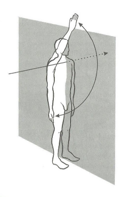
   
  <em>Fig 2: Plano sagital</em>

- Plano frontal - vai de um lado ao outro do corpo, dividindo-o em duas metades, a da frente e a de trás. 
Os movimentos que ocorrem neste plano são a adução e abdução.

  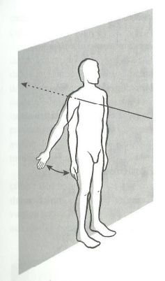
   
  <em>Fig 3: Plano frontal</em>

- Plano transverso - é horizontal, dividindo o corpo em partes superior e inferior. Neste plano ocorrem os movimentos de rotação.

  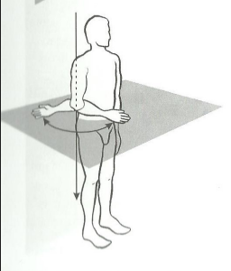
   
  <em>Fig 4: Plano transverso</em>

Observação: Em muitas articulações são possíveis movimentos combinados. Por exemplo, a circundução(flexão-abdução-extensão-adução), mas a goniometria mede apenas os movimentos que ocorrem em um único plano.

# Amplitude de Movimento

Amplitude de movimento (ADM) é a quantidade de movimento de uma articulação. A posição inicial para se medir a amplitude de movimento de todas as articulações, com exceção dos movimentos de rotação, é a posição anatômica.

O que é amplitude de movimento ativa? Refere-se à quantidade de movimento articular realizada por um indivíduo sem qualquer auxílio.
Quando a amplitude é realizada ativamente, o examinador tem a informação exata sobre a capacidade, coordenação e força muscular da amplitude de movimento do indivíduo. Ao testar a ADM ativa, e o indivíduo a completar sem esforço e sem dor, tem-se a noção exata da real condição da amplitude de movimento.

O que é amplitude de movimento passiva? É a quantidade de movimento realizada pelo examinador sem a ajuda do indivíduo. A ADM passiva fornece ao examinador a informação exata sobre a integridade das superfícies articulares e a extensibilidade da cápsula articular, ligamentos e músculos (Norkin, 1997). Ocorrendo dor durante a ADM passiva, ela se deve, muitas vezes, ao movimento de estiramento ou compressão das estruturas não contráteis. A quantidade de ADM passiva é determinada pelo tipo de estrutura da articulação que está sendo testada: cápsulas, ligamentos, tendão ou músculo.

# Expressão Numérica

Moore (1949) fez extensa revisão de literatura sobre a goniometria e descreve diferentes instrumentos e métodos utilizados para avaliar os movimentos articulares, referindo-se em especial à goniometria e salientando a grande confusão que a expressão numérica dos movimentos articulares produziu ao longo dos anos, assim como os diversos métodos propostos para medir os ângulos articulares. Desde a década de 1950, a maioria das escolas de Fisioterapia dos Estados Unidos já adotava a escala de 0-180 graus. De acordo com esse sistema, na postura anatômica ereta, as articulações acham-se a zero grau de movimento. Nesta posição os pés estão em ângulo reto com as pernas, as mãos voltadas para a frente. Assim, o arco de movimento começa em zero grau e vai até um máximo de 180 graus. A exceção fica por conta dos movimentos de rotação.
A definição e o perfeito conhecimento dos valores normais da amplitude de movimento oferecem algumas vantagens, especialmente a base para comparação durante as diferentes fases do tratamento. Neste manual os valores normais apresentados nos Quadros 1, 2 e 3 baseiam-se na proposta a American Academy of North America Surgeons (1965) e The Veterans Administration of United States of North America (1963). Um dos trabaIhos propostos por Marques (1990) que tinha por objetivo ensinar alunos de Fisioterapia a avaliar os ângulos articulares de pacientes reumáticos, mostrou que é possível obter resultados confiáveis a partir do perfeito conhecimento das normas utilizadas para medir os ângulos articulares.

# Registro da Amplitude de Movimento

Ao fazer a goniometria de uma articulação, esta última pode ter movimentos normais, diminuídos ou aumentados. Se estiverem diminuídos chamamos de hipomóveis e se estiverem aumentados chamamos de hipermóveis.
Para se obter informações mais precisas e confiáveis, o registro da amplitude de movimento deve indicar o valor inicial e final. É o chamado arco de movimento. Por exemplo: os 70 graus de flexão do cotovelo podem ser interpretados de várias formas. Uma intepretação possível é que, embora o movimento seja de 70 graus, o arco de movimento é des- conhecido; outra interpretação é concluir que o movimento possível de flexão do cotovelo é de 70 graus, porém sem saber onde ele começa ou termina.
No exemplo anterior, sabendo-se que a amplitude de movimento do braço é de 0-145 graus, é necessário registrar o arco de movimento, ou seja, o início e o final do movimento.

Exemplo: Suponha que a flexão do cotovelo vai de 20-145 graus. Isto significa que há uma limitação de 20 graus na extensão e dizemos que há um flexo de 20 graus. Por outro lado, se a flexão for de 0-115 graus dizemos que a flexão está limitada em 30 graus. Pode ainda haver hipermobilidade (Figura 7).

  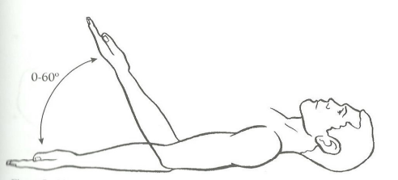
   
  <em>Fig 5: Limitação na flexão do braço. Este indivíduo tem 85 graus de limitação da flexão do braço</em>

  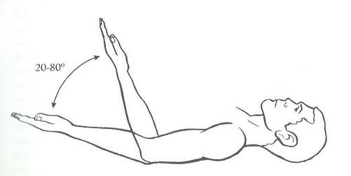
   
  <em>Fig 6: Limitação na extensão do braço. Este indivíduo tem 20 graus de limitação na extensão do braço</em>

  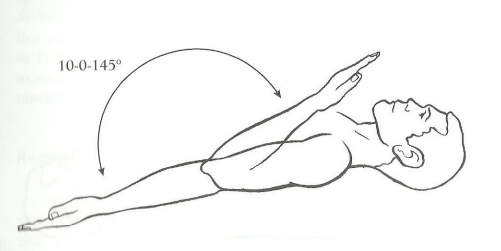
   
  <em>Fig 7: Hiperextensão do braço. Este indivíduo tem 10 graus de hiperextensão do braço</em>

# Princípios do Método

- O examinador poderá usar um lápis dermatográfico, para após localizar os pontos anatômicos desejados assinalá-los, e com isso facilitar a realização e a confiabilidade das medidas. O uso do lápis dermatográfico pode ser substituído por etiquetas adesivas.
- Se as roupas do indivíduo interferirem no acesso à palpação dos pontos anatômicos utilizados para direcionar a colocação dos braços fixo e móvel do goniômetro, elas devem ser removidas. O ideal é permanecer com a região a ser avaliada descoberta.
- Para realizar a goniometria, recomenda-se a utilização do movimento passivo, ou seja, o indivíduo realiza o movimento e, nos graus finais, pode receber o auxílio do fisioterapeuta. Também pode ser utilizado o movimento ativo. Chamamos a atenção para o fato de que deve ser usada sempre a mesma metodologia: ou o movimento ativo ou o passivo.
- Antes de iniciar a avaliação, explicar ao paciente de forma clara o movimento que deve realizar e, se necessário, fazer demonstração do mesmo.
- Colocar o paciente num bom alinhamento corporal, o mais próximo possível da postura anatômica. O cuidado com o alinhamento deve ser grande, uma vez que qualquer compensação pode falsear sensivelmente os resultados obtidos.
- Quando o corpo estiver alinhado, ensina-se o paciente a movimentar a articulação em toda a sua amplitude, a fim de localizar, por inspeção, o eixo aproximado do movimento. Se necessário, ajudar o paciente.
- Se o indivíduo tem um lado comprometido e um considerado são, este também deve ser medido para efeito de comparação. Caso os dois lados estejam comprometidos, utilizar para fins de comparação a tabela de ângulos normais.
- As mudanças de posição devem ser programadas para não manipular o paciente excessivamente. Assim, em vez de medir primeiro os membros superiores, depois os membros inferiores e por último a coluna, melhor seria medir tudo oque fosse possível sucessivamente em decúbio dorsal, sentado, em pé etc.
- Os dados devem ser registrados de forma cuidadosa e correta, preferencialmente em um protocolo construído para esta finalidade. O registro deve incluir o nome do avaliador, data e se foi utilizado movimento passivo ou ativo (Ver protocolo no final deste livro).
- De preferência, o mesmo fisioterapeuta deve realizar toda a seqüência de medidas. Este procedimento aumenta a confiabilidade das medidas (Elveru, et al., 1988; Gajdosik e Bohannon, 1987; Riddle e al., 1987).

# 1 - ÂNGULOS ARTICULARES DOS MEMBROS SUPERIORES

| ARTICULAÇÃO                    | MOVIMENTO       | GRAUS DE MOVIMENTO |
|:-------------------------------|:----------------|:-------------------|
| **Ombro**                      | Flexão          | 0 - 180            |
|                                | Extensão        | 0 - 45             |
|                                | Adução          | 0 - 40             |
|                                | Abdução         | 0 - 180            |
|                                | Rotação medial  | 0 - 90             |
|                                | Rotação lateral | 0 - 90             |
| **Cotovelo**                   | Flexão          | 0 - 145            |
|                                | Extensão        | 145 - 0            |
| **Radiulnar**                  | Pronação        | 0 - 90             |
|                                | Supinação       | 0 - 90             |
| **Punho**                      | Flexão          | 0 - 90             |
|                                | Extensão        | 0 - 70             |
|                                | Adução          | 0 - 45             |
|                                | Abdução         | 0 - 20             |
| **Carpometacarpal do polegar** | Flexão          | 0 - 15             |
|                                | Abdução         | 0 - 70             |
|                                | Extensão        | 0 - 70             |
| **Metacarpofalângicas**        | Flexão          | 0 - 90             |
|                                | Extensão        | 0 - 30             |
|                                | Abdução         | 0 - 20             |
|                                | Adução          | 0 - 20             |
| **Interfalângicas**            | Flexão          | 0 - 110            |
|                                | Extensão        | 0 - 10             |

Quadro 1- Amplitude normal dos ângulos articulares dos membros superiores.

## 1.1 - Articulação do Ombro

### 1.1.1 MOVIMENTO DE FLEXÃO DO BRAÇO

0 - 180 graus. O movimento deve ser realizado levando o braço para a frente, com a palma da mão voltada medialmente paralela ao plano sagital (Figura 8). 
Posição ideal: De preferência o indivíduo sentado e a posição alternativa em pé com os braços ao longo do corpo, podendo também ficar deitado em decúbito dorsal mantendo sempre um bom alinhamento postural.
Braço fixo do goniômetro: Deve ser colocado ao longo da linha axilar média do tronco, apontando para o trocanter maior do fêmur.
Braço móvel do goniômetro: Deve ser colocado sobre a superfície lateral do corpo do úmero voltado para o epicôndilo lateral.
Eixo: O eixo do goniômetro fica próximo ao acrômio, porém a colocação correta dos braços do goniômetro não deve ser alterada a fim de que o eixo coincida com o mesmo.

  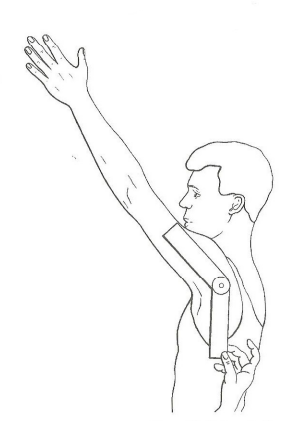
   
  <em>Fig 8: Colocação do goniômetro para medir o movimento de flexão do braço.</em>

Observação: O individuo pode tentar substutuir a extensão do tronco abdução do braço ou elevação da escápula pela flexão do braço. Durante o movimento, manter o braço junto ao corpo.

### 1.1.2 MOVIMENTO DE EXTENSÃO DO BRAÇO
0-45 graus. A palma da mão voltada medialmente, paralela ao plano sagital, e o braço para trás (Figura 9).

Posição ideal: O indivíduo poderá ficar sentado, em pé, ou deitado em decúbito ventral matendo os braços ao longo do corpo.
Braço fixo do goniômetro: Deve ser colocado ao longo da linha axilar média do tronco, apontando para o trocanter maior do fêmur.
Braço móvel do goniômetro: Deve ser colocado sobre a superfície lateral do corpo do úmero voltado para o epicôndilo lateral.
Eixo:  Sobre o eixo látero-lateral da articulação glenoumeral, próximo ao acrômio.

  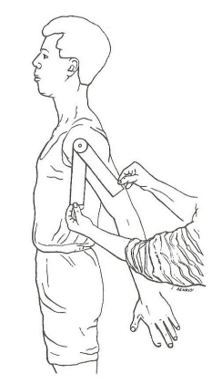
   
  <em>Fig 9: Colocação do goniômetro para medir a extensão do braço.</em>

Observação: A Extensão pode ser medida com o cotovelo estendido ou fletido. Atenção, pois o indivíduo pode tentar substituir a extensão do braço pela flexão do tronco ou pela elevação da escápula.

### 1.1.3 MOVIMENTO DE ABDUÇÃO DO BRAÇO

0 - 180 graus. O movimento deve ser realizado elevando o braço lateralmente em relação ao tronco. Neste movimento inclui-se o movimento da escápula a partir dos 90° (Figura 10).

Posição ideal: Sentado ou em pé, mas de costas para o fisioterapeuta. A palma da mão ficará voltada anteriormente, paralela ao plano frontal.
Braço fixo do goniômetro: Deve ficar sobre a linha axilar posterior do tronco.
Braço móvel do goniômetro: Colocá-lo sobre a superfície posterior do braço do indivíduo, voltado para a região dorsal da mão.
Eixo: O eixo do movimento ficará próximo ao acrômio, porém não se deve ajustar o goniômetro a fim de fazer coincidir seu eixo sobre este ponto anatômico.

  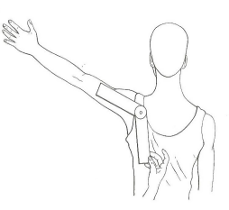
   
  <em>Fig 10: Colocação do goniômetro para medir a abdução do braço.</em>

Observação: Eitar a flexão lateral do tronco, a flexão e extensão do braço e a elevação da escápula.

### 1.1.4 MOVIMENTO DE ADUÇÃO DO BRAÇO

0 -40 graus. Apesar de alguns autores considerarem a adução como o movimento inverso da abdução, neste manual será considerado o movimento de adução na frente do corpo com a palma da mão voltada posteriormente numa flexão de 90 graus do ombro (Figura 11).

Posição ideal: A posição de preferência é sentada, podendo o indivíduo ficar em pé com o cotovelo, punho e dedos estendidos, de frente para o fisioterapeuta.
Braço fixo do goniômetro: Paralelo à linha mediana anterior.
Braço móvel do goniômetro: Sobre a superfície lateral do úmero.
Eixo: Sobre o eixo ântero-posterior da articulação glenoumeral.

  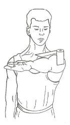
   
  <em>Fig 11: Colocação do goniômetro para medir a adução do braço.</em>

Observação: Antes de iniciar a medida, observar se o ombro está com 90° de flexão.

### 1.1.5 MOVIMENTO DE ROTAÇÃO MEDIAL DO BRAÇO

0 - 90 graus (Figura 12).

Posição ideal: Preferencialmente o indivíduo deve ficar deitado em decúbito dorsal, e o ombro numa abdução de 90°, com o cotovelo também fletido a 90° e o antebraço em supinação. A palma da mão voltada medialmente, paralela ao plano sagital e o antebraço perpendicular à mesa. O úmero descansará sobre o apoio e só o cotovelo deve sobressair-se da borda.
Braço fixo do goniômetro: Paralelo ao solo.
Braço móvel do goniômetro: Quando o movimento estiver completo, ajustá-lo sobre a região posterior do antebraço dirigido para o terceiro dedo da mão.
Método alternativo para o braço fixo do goniômetro: Colocá-lo sobre a região posterior do antebraço, dirigido para o terceiro dedo da mão.
Eixo: No olécrano.

  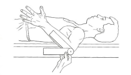
   
  <em>Fig 12: Colocação do goniômetro para medir o movimento de rotação medial do braço.</em>

Observação: Observar um possivel aumento ou reduçao da abduçao ou adução do ombro durante a realização da goniometria e ainda a protração do ombro. Evitar a adução ou abdução da mão.

### 1.1.6 MOVIMENTO DE ROTAÇÃO LATERAL DO BRAÇO

0 - 90 graus (Figura 13).
Posição ideal: Preferencialmente o indivíduo ficará deitado em decúbito dorsal. O ombro deve estar numa abdução de 90°, e o cotovelo também fletido a 90° e o antebraço em supinação. A palma da mão voltada medialmente, paralela ao plano sagital e o antebraço perpendicular à mesa. O úmero descansará sobre o apoio e só o cotovelo deve sobressair-se da borda.
Braço móvel do goniômetro: Quando o movimento estiver completo, ajustá-lo sobre a região posterior do antebraço, dirigido para o terceiro dedo da mão.
Braço fixo do goniômetro: Paralelo ao solo.
Método alternativo para o braço fixo do goniômetro: Colocá-lo sobre a região posterior do antebraço dirigido para o terceiro dedo da mão.
Eixo: No olécrano.

  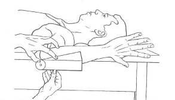
   
  <em>Fig 13: Colocação do goniômetro para medir a rotação lateral do braço.</em>

Observaçao: Observar um possivel aumento ou redução da abdução ou adução do braço durante a realização da goniometria. Evitar a adução ou abdução da mão.

## 1.2 - Articulação do Cotovelo

### 1.2.1 MOVIMENTO DE FLEXÃO E EXTENSÃO DO ANTEBRAÇO

0 - 145 graus.
O movimento de extensão é considerado o retorno da flexão, ou seja, 145° - 0°. Será realizado com a palma da mão mantida na posição anatômica (Figura 14).
Posição ideal: As posições preferidas serão a sentada, em pé ou deitado em decúbito dorsal com o membro superior posicionado junto ao tronco, respeitando a posição anatômica.
Braço fixo do goniômetro: Deve ser colocado ao longo da superficie lateral do úmero orientado para o acrômio.
Braço móvel do goniômetro: Deverá ficar sobre a face lateral do rádio apontando parao processo estilóide do mesmo.
Eixo: Aproximadamente no epicôndilo lateral do úmero.

  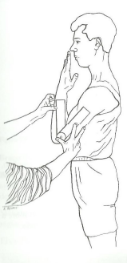
   
  <em>Fig 14: Colocação do goniómetro para medir a flexão do cotovelo.</em>

## 1.3 - Articulação Radiulnar Proximal

### 1.3.1 MOVIMENTO DE PRONAÇÃO DO ANTEBRAÇO

0 - 90 graus (Figura 15).
Posição ideal: De preferência o indivíduo ficará sentado, porém poderá ficar em pé, ou ainda deitado em decúbito dorsal. O cotovelo deve ficar fletido a 90° mantendo-se o braço junto ao corpo e o antebraco em posião neutra entre a pronação e a supinação. O goniômetro é colocado na superfície dorsal dos metacarpais.
Braço fixo do goniômetro: Colocá-lo sobre a superfície dorsal dos metacarpais, paralelo ao eixo longitudinal do úmero. О goniômetro permanece fixo.
Braço móvel do goniômetro: Alinhá-lo paralelo ao eixo do lápis ou do polegar, devendo acompanhar o movimento de pronação.
Eixo: Sobre a articulação metacarpofalângica do dedo médio
Método alternativo: Colocar o goniômetro sobre a superfície dorsal do punho no nível do processo estilóide da ulna.

  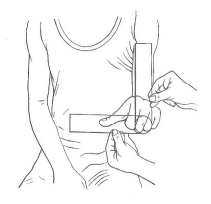
   
  <em>Fig 15: Colocação do goniômetro para medir a pronação.</em>

### 1.3.1 MOVIMENTO DE SUPINAÇÃO DO ANTEBRAÇO

0 - 90 graus (Figura 16).
Posição ideal: De preferência o indivíduo ficará sentado, porém poderá ficar em pé, ou ainda deitado em decúbito dorsal. O cotovelo deve ficar fletido a 90° mantendo-se o braço junto ao corpo e o antebraço em posição neutra entre a pronação e a supinação. O goniômetro é colocado na superficie dorçal metacarpais.
Braço fixo do goniômetro: Colocálo sobre a superfície dorsal dos metacarpais, paralelo ao eixo longitudinal do úmero. O goniômetro permanece fixo.
Braço móvel do goniômetro: Alinhá-lo paralelo ao eixo do lápis ou do polegar, devendo acompanhar o movimento de supinação.
Método alternativo: Colocar o goniômetro na superfície anterior do punho, no nível do processo estilóide da ulna.

  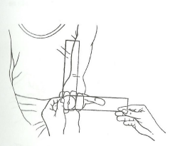
   
  <em>Fig 16: Colocação do goniômetro para medir a supinação.</em>

Observações: a) Manter o cotovelo junto ao corpo sem nenhuma abdução nem rotação do ombro. O goniômetro deve ficar próximo a região carpal no extremo distal do rádio e ulna. Evitar a flexão lateral do carpo para o lado oposto. b) É difícil manter a posição do braço fixo do goniômetro.

## 1.4 - Articulação do Punho

### 1.4.1 MOVIMENTO DE FLEXÃO DA MÃO

0 - 90 graus (Figura 17).
Posição ideal: O indivíduo poderá ficar em pé, ou sentado com o antebraço em pronação e com o cotovelo fletido a aproximadamente 90°. Os dedos ficarão estendidos quando for realizado o movimento.
Braço fixo do goniômetro: Deve ser colocado sobre a face medial da ulna.
Braço móvel do goniômetro: Deve ficar sobre a superfície medial do quinto metacarpal.
Eixo: Superfície medialdo punho.

  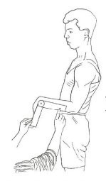
   
  <em>Fig 17: Colocação do goniômetro para medir a flexão do punho.</em>

Observação: Apalpar a região da eminência hipotenar a fim de ajustar o goniômetro sobre a superfície medial do quinto metacarpal.

### 1.4.2 MOVIMENTO DE EXTENSÃO DA MÃO

0 - 70 graus (Figura 18).
Posição ideal: O indivíduo poderá ficar em pé ou sentado com o antebraço em pronação e com o cotovelo fletido a aproximadamente 90°.
Braço fixo do goniômetro: Deve ser colocado sobre a face medial da ulna.
Braço móvel do goniômetro: Sobre a superfície medial do quinto metacarpal.
Eixo: Superfície medial do punho.

  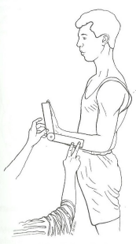
   
  <em>Fig 18: Colocação do goniômetro para medir a extensão do punho.</em>

Observação: Apalpar a região da eminência hipotenar a fim de ajustar o goniômetro sobre a superfície medial do quinto metacarpal.

### 1.4.3 MOVIMENTO DE ABDUÇÃO DA MÃO OU DESVIO RADIAL

0 - 20 graus. O goniômetro deve ser colocado no dorso da mão. É importante observar que deve ser mantida a posição anatômica da mão quando forem realizadas as medidas (Figura 19).
Posição ideal: O indivíduo pode ficar em pé ou sentado com o cotovelo fletido e o ante-braço em pronação, ou em posição neutra entre a pronação e a supinação. A mão deve realizar a abdução.
Braço fixo do goniômetro: Deve ser colocado sobre a região posterior do antebraço, apontando para o epicôndilo lateral.
Braço móvel do goniômetro: Colocá-lo sobre a superfície dorsal do terceiro metacarpal.
Eixo: Sobre a articulação radiocarpal.

  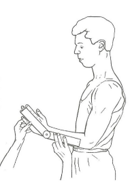
   
  <em>Fig 19: Colocação do goniômetro para medir a abdução da mão.</em>

Observação: Evitar a flexão ou extensão do punho ou a supinação do antebraço. Não se deve utilizar a falange como ponto de referência, devido ao próprio movimento da articulação metacarpofalângica.

### 1.4.4 MOVIMENTO DE ADUÇÃO DA MÃO OU DESVIO ULNAR

0 -45 graus. A adução utiliza os mesmos pontos da abdução (Figura 20).
Posição ideal: O indivíduo ficará em pé ou sentado com o cotovelo fletido e o antebraço na posição neutra entre a pronação e supinação, devendo a mão realizar a abdução.
Braço fixo do goniômetro: Deve ser colocado sobre a região posterior do antebraço, dirigido para o epicôndilo lateral do úmero.
Braço móvel do goniômetro: Colocá-lo paralelo e sobre a superfície dorsal do terceiro metacarpal.
Eixo: Sobre a articulação radiocarpal.

  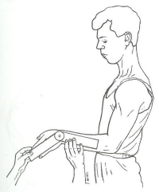
   
  <em>Fig 20: Colocação do goniômetro para medir a adução do punho.</em>

Observação: Evitar a flexão ou extensão do punho ou a pronação е supinação do antebraço. Não se deve utilizar a falange como ponto de referência, devido ao próprio movimento da articulação metacarpofalângica.

## 1.5 - Articulação Carpometacarpal do Polegar

### 1.5.1 MOVIMENTO DE FLEXÃO

0 - 15 graus (Figura 21).
Posição ideal: A posição de preferência é a sentada, antebraço apoiado numa mesa e em supinação. O punho e os dedos estendidos.
Braço fixo do goniômetro: Sobre a superfície lateral do segundo metacarpal.
Braço móvel do goniômetro: Sobre a superfície lateral da articulação carpometacarpal do polegar.
Eixo: Sobre a linha articular da articulação carpometacarpal do polegar.

  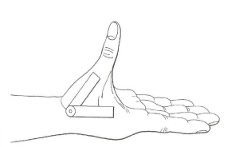
   
  <em>Fig 21: Colocação do goniômetro para medir a flexão do polegar.</em>

### 1.5.2 MOVIMENTO DE EXTENSÃO

0 - 70 graus (Figura 22).
Posição ideal: A posição de preferência é a sentada, com o cotovelo fletido, antebraço apoiado numa mesa e em supinação. O punho e os dedos estendidos.
Braço fixo do goniômetro: Sobre a face lateral do rádio.
Braço móvel do goniômetro: Sobre a superfície lateral do primeiro metacarpal.
Eixo: Sobre a linha articular da articulação carpometacarpal do polegar.

  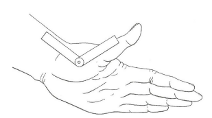
   
  <em>Fig 22: Colocação do goniômetro para medir a extensão do polegar.</em>

### 1.5.3 MOVIMENTO DE ABDUÇÃO

0 - 70 graus (Figura 23).
Posição ideal: A posição de preferência é a sentada, antebraço apoiado numa mesa e em pronação. O punho e os dedos em posição anatômica e o cotovelo fletido.
Braço fixo do goniômetro: Alinhado e paralelo à superfície lateral do segundo metacarpal.
Braço móvel do goniômetro: Na superfície dorsal do primeiro metacarpal.
Eixo: Sobre a linha articular da articulação carpometacarpal do polegar.

  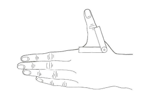
   
  <em>Fig 23: Colocação do goniômetro para medir a abdução do polegar</em>

## 1.6 - Articulações Metacarpofalângica

### 1.6.1 Movimento de flexão dos dedos

0 - 90 graus (Figura 24).
Posição ideal: A posição preferida é a sentada com o cotovelo fletido а 90° e o antebraço numa posição entre a pronação e a supinação, mantendo o punho e os dedos estendidos
Braço fixo do goniômetro: O goniômetro será colocado sobre a superfície dorsal do metacarpo. Pode-se ainda tomar a medida na superfície lateral, para o primeiro e o segundo dedos, ou na medial para o dedo do quinto metacarpo.
Braço móveldo goniômetro: Será colocado sobre a superfície dorsal da falange proximal. Pode-se ainda tomar a medida na superfície lateral para o primeiro e segundo dedos, ou na medial, para o quinto dedo.
Eixo: Sobre a linha articular da articulação metacarpofalângica que está sendo avaliada.

  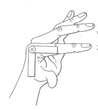
   
  <em>Fig 24: Colocação do goniômetro para medir a abdução do polegar</em>

Observação: No caso de não se ter um goniômetro adequado, podese contornar o movimento desejado numa folha de papel e em seguida realizar a goniometria no próprio contorno.

### 1.6.2 MOVIMENTO DE EXTENSÃO DOS DEDOS

0 - 30 graus (Figura 25).
Posição ideal: A posição preferida é a sentada com o cotovelo fletido a 90 graus e em pronação com o antebraço apoiado em uma mesa, mantendo o punho e os dedos estendidos.
Braço fixo do goniômetro: Deve ser colocado sobre a superfície dorsal do metacarpo. Pode-se ainda tomar a medida na superfície lateral, para primeiro e segundo dedos, ou na medial, para o quinto dedo.
Braço móvel do goniômetro: Sobre a superfície dorsal da falange proximal. Pode-se ainda tomar a medida na superfície lateral, para o primeiro e segundo dedos, ou na medial, para o quinto dedo.
Eixo: Sobre a linha articular da articulação metacarpofalângica.

  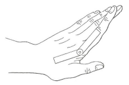
   
  <em>Fig 25: Colocação do goniômetro para medir a extensão das articulações metacarpofalângicas.</em>

Observação: Alternativamente o goniômetro pode ser colocado na região palmar.

### 1.6.3 MOVIMENTO DE ABDUÇÃO E ADUÇÃO DOS DEDOS

0 - 20 graus (Figura 26).
Posição ideal: Sentado, com o antebraço apoiado numa mesa, o cotovelo fletido a 90°, o antebraço em pronação, punho em extensão e dedos em posição neutra de flexo-extensão.
Braço fixo do goniômetro: Deve ser colocado sobre a su- perfície do metacarpo da arti- culação metacarpofalângica.
Braço móvel do goniômetro: Sobre a superfície dorsal da falange proximal da articula- ção que está sendo medida.
Eixo: Sobre a linha articular da articulação que está sendo medida.

  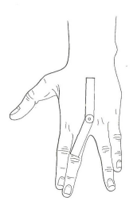
   
  <em>Fig 26: Colocação do goniômetro para medir a abdução e adução da articulação metacarpofalângica.</em>

Observação: O referencial do movimento dexe ser uma linha imaginária passando no terceiro dedo: no afastamento é considerada a abdução, e na aproximação, a adução.

## 1.7 - Articulações Interfalângicas Proximais e Distais dos Dedos e do Polega

### 1.7.1 MOVIMENTO DE FLEXÃO

0 - 110 graus (Figura 27).
Posição ideal: A posição de preferência é a sentada. antebraco anoiado numa mesa. punho fletido em posição intermediária entre a pronação ea  supinação ou em pronação.
Braço fixo do goniômetro:
 - Interfalângica proximal: sobre a superfície dorsal da falange proximal. Podese ainda tomar a medida na superfície lateral, para o primeiro e segundo dedos ou na medial, para o quinto dedo;
 - Interfalângica distal: sobre a superfície doreal da falange média Pode-se ainda tomar a medida na superfície lateral para o primeiro e segundo de- dos, ou na medial para o quinto dedo.
Braço móvel do goniômetro:
 - Interfalângica proximal: sobre a superfície dorsal da falange distal. Pode-se ainda tomar a medida na superfície lateral, para o primeiro e segundo dedos, ou na medial para o quinto dedo;
 - Interfalângica distal: sobre a superfície dorsal da falange distal. Pode- se ainda tomar a medida na superfície lateral, para o primeiro e segundo dedos, ou na medial, para o quinto dedo.
Eixo: Sobre a linha articular da articulação que está sendo medida.

  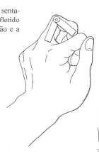
   
  <em>Fig 27: Colocação do goniômetro para medir a flexão das articulações interfalângicas proximais e distais. </em>

### 1.7.2 MOVIMENTO DE EXTENSÃO

0 - 10 graus (Figura 28).
Posição ideal: A posição de preferência é a sentada, antebraço apoiado numa mesa, cotovelo fletido em posição intermediária entre a pronação e a supinação ou em pronação.
Braço fixo do goniômetro:
 - Interfalângica proximal: sobre a superfície palmar da falange proximal. Pode-se ainda tomar a medida na superfície lateral para o primeiro e segundo dedos ou na medial para o quinto dedo;
 - Interfalângica distal: sobre a superfície palmar da falange média. Pode-se ainda tomar a medida na superfície lateral para o primeiro e segundo dedos ou na medial para o quinto dedo.
Braço móvel do goniômetro:
 - Interfalângica proximal: sobre a superfície palmar da falange média. Pode-se ainda tomar a medida na superfície lateral para o primeiro e segundo dedos ou na medial para o quinto dedo;
 - Interfalângica distal: sobre a superfície palmar da falange distal. Podese ainda tomar a medida na superfície lateral para o primeiro e segundo dedos ou na medial para o quinto dedo.
Eixo: Sobre a linha articular da articulação que está sendo medida.

  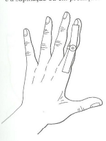
   
  <em>Fig 28: Colocação do goniômetro para medir a extensão das articulações interfalângicas proximais e distais.</em>

# 2 - ÂNGULOS ARTICULARES DOS MEMBROS INFERIORES

| ARTICULAÇÃO             | MOVIMENTO                     | GRAUS DE MOVIMENTO |
|:------------------------|:------------------------------|:-------------------|
| **Quadril**             | Flexão                        | 0 - 125            |
|                         | Extensão                      | 0 - 10             |
|                         | Adução                        | 0 - 15             |
|                         | Abdução                       | 0 - 45             |
|                         | Rotação medial                | 0 - 45             |
|                         | Rotação lateral               | 0 - 45             |
| **Joelho**              | Flexão                        | 0 - 140            |
| **Tornozelo**           | Flexão dorsal                 | 0 - 20             |
|                         | Flexão plantar                | 0 - 45             |
|                         | Abdução                       | 0 - 20             |
|                         | Adução                        | 0 - 40             |
| **Metatarsofalângicas** | Flexão - Primeiro dedo        | 0 - 45             |
|                         | Segundo ao quinto dedo        | 0 - 40             |
|                         | Extensão - Primeiro dedo      | 0 - 90             |
|                         | Segundo ao quinto dedo        | 0 - 45             |
| **Interfalângicas**     | Flexão (I) - Primeiro dedo    | 0 - 90             |
|                         | (IP) - Segundo ao quinto dedo | 0 - 35             |
|                         | (ID) - Segundo ao quinto dedo | 0 - 60             |

Quadro 2 - Amplitude normal dos ângulos articulares dos membros inferiores.

## 2.1 - Articulação do Quadril

### 2.1.1 MOVIMENTO DE FLEXÃO DA COXA

0-125 graus. A medida é feita na superficie lateral da coxa sobre a articulação do quadril, com o joelho fletido. É importante lembrar que a flexão do quadril com o joelho estendido é de 90° (Figura 29).
Posição ideal: O indivíduo ficará deitado em decúbito dorsal, podendo também ficar em decúbito lateral utilizando-se o membro do hemicorpo superior para efetuar a medição.
Braço fixo do goniômetro: O goniômetro deve ser colocado na linha média axilar do tronco.
Braço móvel do goniômetro: Paralelo e sobre a superfície lateral da cоха, em direção ao côndilo lateral do fêmur.
Eixo: Aproximadamente no nível do trocanter maior.

  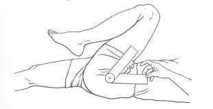
   
  <em>Fig 29: Colocação do goniômetro para medir o movimento de flexão da coxa.</em>

Observação: Esta medida é difícil de ser feita devido ao volume dos músculos da coxa e do quadril. É importante localizar os referidos pontos para certificar-se da colocação correta do goniometro.

### 2.1.2 MOVIMENTO DE EXTENSÃO DA COXA

0-10 graus (Figura 30).
Posição ideal: O indivíduo deve preferencialmente ficar em decúbito ventral e alternativamente em decúbito lateral.
Braço fixo do goniômetro: O goniometro será colocado na linha axilar média do tronco.
Braço móvel do goniômetro: Colocá-lo ao longo da superfície lateral da coxa, em direção ao côndilo lateral do fêmur.
Eixo: Aproximadamente no nível do trocanter maior.

  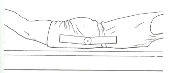
   
  <em>Fig 30: Colocação do goniómetro para medir o movimento de extensão da cоха.</em>

Observação: O indivíduo deverá manter as espinhas ilíacas ântero-superiores apoiadas no leito, a fim de garantir a não movimentação da coluna lombar.

### 2.1.3 MOVIMENTO DE ABDUÇÃO DA COXA

0-45 graus (Figura 31).
Posição ideal: O indivíduo será colocado em decúbito dorsal, observando o alinhamento corporal. A medida é feita na região anterior da coxa, sobre a articulação da coxa.
Braço fixo do goniômetro: Deve ser colocado sobre a linha traçada entre as espinhas ilíacas ântero-superiores ou nivelado com as espinhas ilíacas ântero-superiores.
Braço móvel do goniômetro: Ficará sobre a região anterior da cоха, ao longo da diáfise do fêmur.
Eixo: Sobre o eixo ântero-posterior da articulação do quadril, aproximadamente no nível do trocanter maior.

  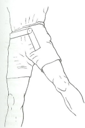
   
  <em>Fig 31: Colocação do goniometro para medir o movimento de abdução da coxa.</em>

Observação: Procurar-se-á manter o paralelismo do braço fixo, ainda que às vezes seja preciso deslocá-lo ficando um pouco abaixo das espinhas ilíacas, para que o braço móvel coincida com o eixo da diáfise do fêmur. Deve-se evitar que os membros inferiores adotem a posição de rotação medial ou lateral.

### 2.1.4 MOVIMENTO DE ADUÇÃO DA COXA

0-15 graus. O membro que não vai ser medido afasta-se em abdução para permitir a adução do outro membro (Figura 32).

Posição ideal: O indivíduo será colocado em decúbito dorsal, observando o alinhamento corporal. A medida é feita na região anterior da coxa sobre a articulação do quadril.
Braço fixo do goniômetro: Deve ser colocado sobre a linha traçada entre as espinhas ilíacas ântero-superiores, ou nivelado com as espinhas ilíacas ântero-superiores.
Braço móvel do goniômetro: Ficará sobre a região anterior da coxa, ao longo da diáfise do fêmur.
Eixo: Sobre o eixo ântero-posterior da articulação do quadril, aproximadamente no nível do trocanter maior.

  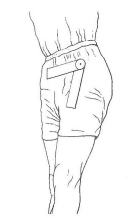
   
  <em>Fig 32: Colocação do goniômetro para medir o movimento de adução da соха.</em>

Observação: A pelve sofrerá um certo deslocamento, porém não deve impedir a colocação correta do goniômetro. O corpo pode rodar na direção do movimento e o quadril tenderá à rotação lateral na abdução e à rotação medial na adução, devendo ambas serem evitadas.

### 2.1.5 MOVIMENTO DE ROTAÇÃO MEDIAL DA COXA

0-45 graus (Figura 33).

Posição ideal: O indivíduo ficará sentado com o joelho e o quadril fletidos a 90° e em posição neutra. A posição alternativa é a deitada em decúbito dorsal e com o joelho e quadril também fletidos a 90°.
Braço fixo do goniômetro: Paralelo e sobre a linha média anterior da tíbia, com o eixo axial próximo ao centro do joelho. O braço fixo do goniômetro não se move quando ocorre o movimento e deve permanecer perpendicular ao chão.
Método alternativo para o braço fixo do goniômetro: Os dois braços do goniômetro podem coincidir com a linha média da tíbia, mantendo-se o eixo fixo e o móvel acompanhando o movimento.
Braço móvel do goniômetro: Deve ser colocado ao longo da tuberosidade da tíbia, num ponto equidistante entre os maléolos na superficie anterior.
Eixo: Na face anterior da patela.

  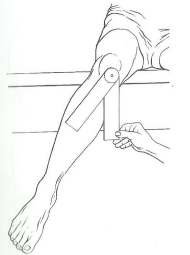
   
  <em>Fig 33: Colocação do goniômetro para medir movimento de rotação medial da coxa.</em>

### 2.1.6 MOVIMENTO DE ROTAÇÃO LATERAL DA COXA

0-45 graus (Figura 34).

Posição ideal: O indivíduo deve estar sentado com o joelho e o quadril fletidos a 90° e em posição neutra. A posição alternativa é deitada em decúbito dorsal com o joelho e quadril fletidos a 90°.
Braço fixo do goniômetro: Perpendicular à margem anterior da tíbia, com o eixo axial sobre a linha articular do joelho. Deve-se manter o goniômetro paralelo ao solo.
Método alternativo para o braço fixo do goniômetro: Os dois braços do goniômetro podem coincidir na margem anterior da tíbia, mantendo-se o eixo fixo e o móvel acompanhando o movimento.
Braço móvel do goniômetro: Deve ser colocado sobre a margem anterior da tibia.
Eixo: Na face anterior da patela.

  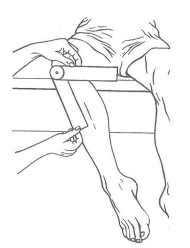
   
  <em>Fig 34: Colocação do goniômetro para medir o movimento de rotação lateral da coxa.</em>

## 2.2 - Articulação do Joelho

### 2.2.1 MOVIMENTO DE FLEXÃO DA PERNA

0-140 graus (Figura 35).

Posição ideal: O indivíduo deitado em decúbito dorsal com o joelho e o quadril fletidos, ou ainda sentado numa mesa com a coxa apoiada e o joelho fletido.
Braço fixo do goniômetro: Paralelo à superficie lateral do fêmur dirigido para o trocanter maior.
Braço móvel do goniômetro: Paralelo à face lateral da fíbula dirigido para o maléolo lateral.
Eixo: Sobre a linha articular da articulação do joelho.

  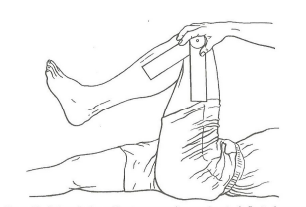
   
  <em>Fig 35: Colocação do goniómetro para medir o movimento de flexão da perna.</em>

## 2.3 - Articulação do Tornozelo ou Talocrural

### 2.3.1 MOVIMENTO DE FLEXÃO OU FLEXÃO DORSAL DO PÉ

0-20 graus. A posição anatômica do pé é a medida que se adota na posição ereta (Figura 36).

Posição ideal: Sentado ou deitado em decúbito ventral ou dorsal porém com os joelhos fletidos e o pé em posição anatômica. Para a realização das medidas utilizar-se-á a superfície lateral da articulação. O joelho deve ser fletido a pelo menos 25° ou 30° para diminuir a ação dos músculos da região posterior da coxa.
Braço fixo do goniômetro: Deve ser colocado paralelo à face lateral da fíbula.
Braço móvel do goniômetro: Colocá-lo paralelo à superfície lateral do quinto metatarsal.
Eixo: Na articulação do tornozelo, junto ao maléolo lateral.

  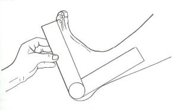
   
  <em>Fig 36: Colocação do goniômetro para medir a flexão do tornozelo.</em>

### 2.3.2 MOVIMENTO DE EXTENSÃO OU FLEXÃO PLANTAR DO PÉ

0-45 graus (Figura 37).

Posição ideal: Sentado ou deitado em decúbito ventral ou dorsal, porém os joelhos devem estar fletidos a pelo menos 25° ou 30° para diminuir a ação do compartimento posterior da coxa, e o pé deve estar em posição anatômica.
Braço fixo do goniômetro: Deve ser colocado paralelo à face lateral da fibula.
Braço móvel do goniômetro: Colocá-lo paralelo à superfície lateral do quinto metatarsal.
Eixo: Na articulação do tornozelo, junto ao maléolo lateral.

  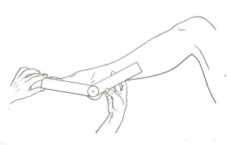
   
  <em>Fig 37: Colocação do goniômetro para medir a extensão do tornozelo.</em>

### 2.3.3 MOVIMENTO DE ADUÇÃO OU INVERSÃO DO PÉ

0-40 graus (Figura 38).

Posição ideal: Sentado, o joelho fletido a 90° e o pé em flexão plantar. Cuidado para não realizar a rotação do joelho ou quadril quando realizar a inversão.
Braço fixo do goniômetro: Alinhado e paralelo sobre a margem anterior da tíbia.
Braço móvel do goniômetro: Sobre a superfície dorsal do segundo metatarsal.
Eixo: Aproximadamente no nível da articulação tibiotarsal.

  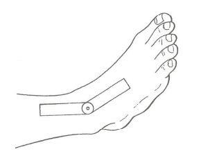
   
  <em>Fig 38: Colocação do goniometro para medir a adução do pé.</em>

Observação: Evitar a rotação do quadril e a flexão e extensão do tornozelo.

### 2.3.4 MOVIMENTO DE ABDUÇÃO OU EVERSÃO DO PÉ

0-20 graus (Figura 39).

Posição ideal: Sentado, porém com o joelho fletido a 90° e o pé em flexão plantar. Cuidado para não realizar a rotação do joelho ou quadril quando realizar a eversão.
Braço fixo do goniômetro: Sobre a margem anterior da tíbia.
Braço móvel do goniômetro: Sobre a superfície dorsal do terceiro metatarsal.
Eixo: Aproximadamente no nível da articulação tibiotarsal.

  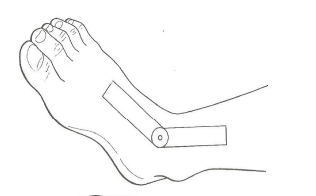
   
  <em>Fig 39: Colocação do goniômetro para medir o movimento de abdução do pé.</em>

Observação: Evitar a rotação do quadril e a flexão e extensão do tornozelo. Não apertar o goniômetro contra o pé.

## 2.4 - Articulações Metatarsofalângicas

### 2.4.1 MOVIMENTO DE FLEXÃO DOS DEDOS

Primeiro dedo (hálux): 0-45 graus. Segundo ao quinto dedo: 0-40 graus (Figura 40).

Posição ideal: Deitado em decúbito dorsal com o tornozelo, pé e dedos na posição anatômica. A posição alternativa é a sentada.
Braço fixo do goniômetro: Sobre a superfície dorsal do metatarsal.
Braço móvel do goniômetro: Sobre a superficie dorsal da falange proximal.
Eixo: Sobre a linha articular da articulação que está sendo medida.

  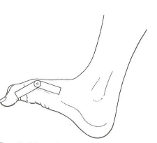
   
  <em>Fig 40: Colocação do goniômetro para medir a flexão das articulações metatarsofalângicas.</em>

Observação: Para o primeiro e quinto dedos, o braço fixo pode ser colocado sobre a superfície medial e lateral do metatarsal e o braço móvel pode ser colocado sobre a superfície medial e lateral da falange proximal, com o eixo respectivamente sobre o ponto médio da superficie medial e lateral da articulação.

### 2.4.2 MOVIMENTO DE EXTENSÃO DOS DEDOS

Primeiro dedo: 0 - 90 graus. Segundo ao quinto dedo: 0-45 graus (Figura 41).

Posição ideal: Deitado em decúbito dorsal com o tornozelo, pé e dedos na posição anatômica. A posição alternativa é a sentada.
Braço fixo do goniômetro: Paralelo e sobre a superfície plantar do metatarsal.
Braço móvel do goniômetro: Sobre a superfície plantar da falange proximal.
Eixo: Sobre a linha articular da articulação que está sendo medida.

  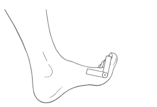
   
  <em>Fig 41: Colocação do goniômetro para medir a extensão das articulações metatarsofalangicas.</em>

## 2.5 - Articulações Interfalângicas (I), Interfalângicas Proximais (IP), Interfalângicas Distais (ID)

### 2.5.1 MOVIMENTO DE FLEXÃO

(I) Primeiro dedo: 0-90 graus. (IP) Do segundo ao quinto dedo: 0-35 graus. (ID) Do segundo ao quinto dedo: 0-60 graus (Figura 42).

Posição ideal: Deitado em decúbito dorsal com o joelho levemente fletido.
Braço fixo do goniômetro: Sobre a superfície dorsal, do segundo ao quinto dedo, e sobre a superfície medial para o hálux da articulação a ser medida.
Braço móvel do goniômetro: Sobre a superficie dorsal do segundo ao quinto dedos e sobre a superficie medial para o hálux da articulação a ser medida.
Eixo: Sobre a linha articular da articulação que está sendo medida.

  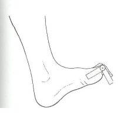
   
  <em>Fig 42: Colocação do goniômetro para medir a flexão das articulações interfalângicas.</em>

---

# 3 - ÂNGULOS ARTICULARES DA COLUNA VERTEBRAL

| MOVIMENTO             | COLUNA VERTEBRAL CERVICAL   (GRAUS)   |  COLUNA VERTEBRAL LOMBAR (GRAUS) |
|:----------------------|:--------------------------------------|:---------------------------------|
| **Flexão**            | 0-65                                  | 0 - 95                           |
| **Extensão**          | 0-50                                  | 0 - 35                           |
| **Flexão lateral**    | 0-40                                  | 0 - 40                           |
| **Rotação**           | 0-55                                  | 0 - 35                           |

Quadro 3 - Amplitude normal dos ângulos da coluna vertebral.
Quadro 3 - Amplitude normal dos ângulos da coluna vertebral.

## 3.1 - Coluna Vertebral Lombar (Região Dorso-Lombar)

### 3.1.1 MOVIMENTO DE FLEXÃO DA REGIÃO LOMBAR

0-95 graus (Figura 43).

Posição ideal: O paciente na posição ortostática com os pés juntos e alinhados. A medida é feita na superfície lateral do indivíduo.
Braço fixo do goniômetro: Coloca-se perpendicular ao solo no nível da crista ilíaca.
Braço móvel do goniômetro: Ao completar o movimento, coloca-se ao longo da linha axilar média do tronco.
Eixo: Espinha ilíaca ântero-superior.

  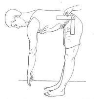
   
  <em>Fig 43: Colocação do goniômetro para medir o movimento de flexão da região lombar.</em>

Observação: Evitar a flexão dos joelhos. É importante observar que a coluna vertebral deve permanecer reta.

### 3.1.2 MOVIMENTO DE EXTENSÃO DA REGIÃO LOMBAR

0-35 graus (Figura 44).

Posição ideal: O paciente em pé, com os pés juntos bem alinhados.
Braço fixo do goniômetro: Deve ser colocado em direção ao côndilo lateral do fêmur.
Braço móvel do goniômetro: Ao completar o movimento, colocá-lo ao longo da linha axilar média do tronco.
Eixo: Espinha ilíaca ântero-superior.

  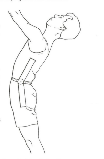
   
  <em>Fig 44: Colocação do goniometro para medir o movimento de extensão da região lombar.</em>

Observação: Evitar a hiperextensão dos joelhos.

### 3.1.3 MOVIMENTO DE FLEXÃO LATERAL DA REGIÃO LOMBAR

0-40 graus (Figura 45).

Posição ideal: O paciente deve estar em pé, bem alinhado e de costas para o fisioterapeuta.
Braço fixo do goniômetro: Deve ser colocado nivelado com as espinhas ilíacas póstero-superiores.
Braço móvel do goniômetro: Pede-se ao paciente que se incline lateralmente. Ao completar o movimento, coloca-se o braço do goniômetro dirigido para o processo espinhoso da sétima vértebra cervical.
Eixo: Entre as espinhas ilíacas póstero-superiores sobre a crista sacral mediana.

  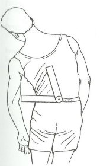
   
  <em>Fig 45: Colocação do goniómetro para medir o movimento de flexão lateral da região lombar.</em>

### 3.1.4 MOVIMENTO DE ROTAÇÃO DA REGIÃO LOMBAR

0-35 graus (Figura 46).

Posição ideal: O indivíduo deve estar sentado bem ereto com a pelve fixa, rodando a coluna para o lado que vai ser avaliado.
Braço fixo do goniômetro: Inicialmente os dois braços do goniômetro coincidem e devem ser colocados no centro da cabeça, paralelos ao solo e sobre a sutura sagital.
Braço móvel do goniômetro: Acompanha o movimento, permanecendo paralelo ao solo e sobre a sutura sagital.
Método alternativo para o braço fixo: Colocá-lo no centro da cabeça com a ponta voltada para o acrômio permanecendo fixo durante o movimento. Braço móvel: O braço móvel acompanha o movimento sempre na direção do acrômio.
Eixo: Centro da cabeça.

  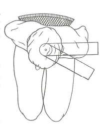
   
  <em>Fig 46: Movimento de rotação da região lombar.</em>

Observação: É importante que, além da pelve, também a coluna cervical permaneça fixa, rodando apenas o tronco.

## 3.2 - Coluna Vertebral Cervical

### 3.2.1 MOVIMENTO DE FLEXÃO DA REGIÃO CERVICAL

0-65 graus (Figura 47).

Posição ideal: A posição preferida é a sentada, podendo o indivíduo ficar em pé de costas para o fisioterapeuta. Não esquecer de alinhar a coluna cervical.
Braço fixo do goniômetro: Será colocado no nível do acrômio e paralelo ao solo, no mesmo plano transverso do processo espinhoso da sétima vértebra cervical.
Braço móvel do goniômetro: Ao final do movimento colocá-lo dirigido para o lóbulo da orelha.

  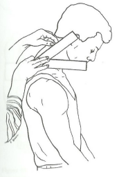
   
  <em>Fig 47: Colocação do goniometro para medir o movimento de flexão da região cervical.</em>

Observação: Utilizando uma caneta, pode-se assinalar um ponto no lóbulo da orelha antes de iniciar as medidas e que servirá como referência para a colocação do goniometro ao final do movimento.

### 3.2.2 MOVIMENTO DE EXTENSÃO DA REGIÃO CERVICAL

0-50 graus (Figura 48).

Posição ideal: A posição preferida é a sentada, podendo o indivíduo ficar em pé de costas para o fisioterapeuta.
Braço fixo do goniômetro: Será colocado no nível do acrômio e paralelo ao solo, no mesmo plano transverso do processo espinhoso da sétima vértebra cervical.
Braço móvel do goniômetro: Ao final do movimento colocá-lo dirigido para o lóbulo da orelha.

  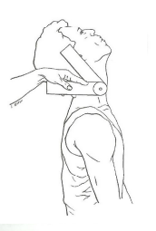
   
  <em>Fig 48: Colocação do goniômetro para medir a extensão da região cervical.</em>

Observação: Antes de iniciar as medidas e com o auxílio de uma caneta, pode-se assinalar um ponto no lóbulo da orelha, que será utilizado como ponto de referência ao final do movimento.

### 3.2.3 MOVIMENTO DE FLEXÃO LATERAL DA REGIÃO CERVICAL

0-40 graus (Figura 49).

Posição ideal: O indivíduo deve estar preferencialmente sentado ou em pé, de costas para o fisioterapeuta.
Braço fixo do goniômetro: Paralelo ao solo.
Braço móvel do goniômetro: Ao final do movimento colocá-lo na linha média da coluna cervical, dirigido para a protuberância occipital externa.
Eixo: Sobre o processo espinhoso da sétima vértebra cervical.

  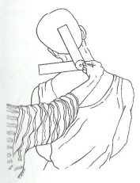
   
  <em>Fig 49: Colocação do goniômetro para medir a flexão lateral da região cervical.</em>

### 3.2.4 MOVIMENTO DE ROTAÇÃO DA REGIÃO CERVICAL

0-55 graus (Figura 50).

Posição ideal: A posição ideal é a sentada com a cabeça e o pescoço na posição anatômica, rodando os mesmos para o lado que vai ser avaliado.
Braço fixo do goniômetro: No centro da cabeça, na sutura sagital.
Braço móvel do goniômetro: Ao final do movimento colocá-lo na sutura sagital.
Eixo: No centro da cabeça.

  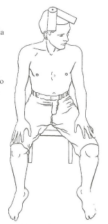
   
  <em>Fig 50: Colocação do goniômetro para medir a rotação da região cervical.</em>

Observação: Evitar a flexão e a extensão da região cervical.

Com base no manual fornecido e seguindo rigorosamente o padrão detalhado do Capítulo 1, aqui estão os Capítulos 4 e 5 para completar o seu arquivo Markdown.

---

# 4 - GONIOMETRIA ESPECIAL

Neste capítulo será realizada a goniometria de algumas deformidades freqüentes em muitos indivíduos e em algumas situações patológicas.

## 4.1 - Joelhos

### 4.1.1 ÂNGULO Q

0-170 graus. O ângulo Q deve-se à posição aduzida da diáfise do fêmur e à direção compensadora da tíbia para transmitir o peso perpendicularmente ao solo. Assim, durante a sustentação de peso sobre a perna, as forças são dirigidas no sentido medial do joelho. Se o ângulo for menor que 170 graus, teremos um genu valgum (joelho valgo), ou se o ângulo se aproximar dos 180 graus a deformidade é chamada genu varum (joelho varo).

Ângulo normal para os homens: 13 graus (Magee, 1997) e 10 a 14 graus (Hamil e Knutzen, 1999).
Ângulo normal para as mulheres: 18 graus (Magee, 1997) e 15 a 17 graus (Hamil e Knutzen, 1999).

  
   
  <em>Fig 51: Ângulo Q dos joelhos.</em>

### 4.1.2 VALGO DE JOELHOS

Posição ideal: Indivíduo em pé, joelhos levemente apoiados um no outro, sem superpô-los. Caso haja dificuldade, realizar as medidas com o indivíduo deitado em decúbito dorsal.
Braço fixo do goniômetro: No centro da patela em direção à espinha ilíaca antero-superior.
Braço móvel do goniômetro: Tuberosidade tibial.
Eixo: Centro da patela.

  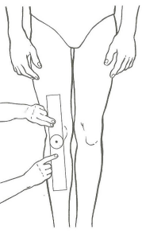
   
  <em>Fig 52: Colocação do goniômetro para medir o valgo de joelhos.</em>

Observação: Não esquecer que um discreto valgo (ver ângulo Q) é fisiológico. No valgo de joelhos o ângulo Q deve estar aumentado.

**Método Alternativo da Medida do Valgo de Joelhos: Uso da fita métrica.**

Posição ideal: Indivíduo em pé, joelhos levemente apoiados um no outro sem superpô-los.
Uso da fita métrica: Medir a distância, com fita métrica, entre os maléolos mediais.

  
   
  <em>Fig 53: Valgo de joelhos medido com fita métrica.</em>

Observação: Atenção para não afastar demais ou superpor os joelhos. As medidas são obtidas em centímetros.

### 4.1.3 VARO DE JOELHOS

Posição ideal: Indivíduo em pé, maléolos mediais juntos. Caso haja dificuldade, realizar as medidas com o indivíduo deitado em decúbito dorsal.
Braço fixo do goniômetro: No centro da patela em direção à espinha ilíaca antero-superior.
Braço móvel do goniômetro: Tuberosidade tibial.
Eixo: Centro da patela.

  
   
  <em>Fig 54: Colocação do goniômetro para medir o varo de joelhos.</em>

Observação: No varo de joelhos o ângulo Q deve estar diminuído.

**Método Alternativo da Medida do Varo de Joelhos: Uso da fita métrica.**

Posição ideal: Indivíduo em pé, maléolos mediais levemente apoiados um no outro.
Uso da fita métrica: Com fita métrica, medir a distância, em centímetros, entre os côndilos mediais do fêmur.

  
   
  <em>Fig 55: Varo de joelhos medido com fita métrica.</em>

Observação: As medidas são obtidas em centímetros.

### 4.1.4 JOELHO RECURVADO

Posição ideal: Indivíduo em pé com os tornozelos juntos. A medida deve ser feita com o indivíduo em decúbito lateral.
Braço fixo do goniômetro: Ao longo da superfície lateral da coxa em direção ao trocanter maior do fêmur.
Braço móvel do goniômetro: Na fíbula em direção ao maléolo lateral do tornozelo.
Eixo: Côndilo lateral do fêmur.

  
   
  <em>Fig 56: Colocação do goniômetro para medir o recurvado de joelhos.</em>

Observação: Em um joelho alinhado, o arco de movimento deve ser de 0-180°.

## 4.2 - Cotovelos

### 4.2.1 ÂNGULO DE CARREGAMENTO DO COTOVELO

Na posição de extensão do cotovelo, a ulna e o úmero formam este ângulo devido à assimetria da tróclea.
Ângulo normal para os homens: aproximadamente 5 graus.
Ângulo normal para as mulheres: varia de 10 a 15 graus (Hoppenfeld, 1987).

  
   
  <em>Fig 57: Ângulo de carregamento do cotovelo.</em>

### 4.2.2 VALGO DE COTOVELOS

Posição ideal: Indivíduo em pé ou sentado, palma da mão voltada para a frente.
Braço fixo do goniômetro: Diáfise do úmero apontado para o acrômio.
Braço móvel do goniômetro: No antebraço apontado para uma linha média entre o rádio e a ulna, em direção ao terceiro dedo.
Eixo: Uma linha através dos centros da tróclea e do capítulo.

  
   
  <em>Fig 58: Colocação do goniômetro para medir o valgo de cotovelos.</em>

Observação: Não esquecer que um discreto valgo é fisiológico.

### 4.2.3 DEFORMIDADE EM RIFLE DO COTOVELO

É uma diminuição do ângulo de carregamento, acarretando um varo de cotovelo e podendo ocorrer em função de um traumatismo, como a fratura supracondiliana, especialmente em crianças.
Ângulo normal para os homens: aproximadamente 5 graus.
Ângulo normal para as mulheres: aproximadamente 10 graus (Hoppenfeld, 1987).

  
   
  <em>Fig 59: Deformidade em rifle do cotovelo.</em>

### 4.2.4 VARO DE COTOVELOS

Posição ideal: Indivíduo em pé ou sentado, palma da mão voltada para a frente.
Braço fixo do goniômetro: Diáfise do úmero apontado para o acrômio.
Braço móvel do goniômetro: No antebraço apontando para uma linha média entre o rádio e a ulna, em direção ao terceiro dedo.
Eixo: Uma linha através dos centros da tróclea e do capítulo.

  
   
  <em>Fig 60: Colocação do goniômetro para medir o varo de cotovelos.</em>

## 4.3 - Deformidades do Pé

### 4.3.1 DEFORMIDADES DO ANTEPÉ

Valgo - Eversão do antepé resulta em pé cavo.
Varo - Inversão do antepé resulta em pé plano.

  
   
  <em>Fig 61: Deformidades do antepé.</em>

Observação: Atenção para o tendão-de-aquiles, que neste caso está alinhado.

### 4.3.2 DEFORMIDADES DO RETROPÉ

Valgo - Eversão do calcâneo - resulta em pé plano.
Varo - Inversão do calcâneo - resulta em pé cavo.

  
   
  <em>Fig 62: Deformidades do retropé.</em>

Observação: Atenção para o tendão-de-aquiles, que neste caso está desalinhado.

**Varo de retropé:**

Posição ideal: O indivíduo em pé.
Braço fixo do goniômetro: Linha média posterior da tíbia.
Braço móvel do goniômetro: Linha média posterior acompanhando o alinhamento do calcâneo.
Eixo do goniômetro: No tendão-de-aquiles entre os dois maléolos.

  
   
  <em>Fig 63: Colocação do goniômetro para medir o varo de retropé.</em>

**Valgo de retropé:**

Posição ideal: O indivíduo em pé.
Braço fixo do goniômetro: Linha média posterior da tíbia.
Braço móvel do goniômetro: Linha média posterior acompanhando o alinhamento do calcâneo.
Eixo do goniômetro: No tendão-de-aquiles a meio caminho entre os dois maléolos.

  
   
  <em>Fig 64: Colocação do goniômetro para medir o valgo de retropé.</em>

### 4.3.3 HÁLUX VALGO

Posição ideal: O indivíduo em pé ou sentado.
Braço fixo do goniômetro: Alinhado sobre o primeiro metatarsal.
Braço móvel do goniômetro: Alinhado sobre a linha média das falanges proximal e distal do hálux.
Eixo: Sobre a articulação metacarpofalângica.

  
   
  <em>Fig 65: Colocação do goniômetro para medir o hálux valgo.</em>

## 4.4 - Medidas da Flexibilidade

### 4.4.1 ÍNDICE DE SCHOBER

Mede a mobilidade do segmento lombossacral da região lombar.

Posição ideal: O indivíduo em posição ortostática e os pés juntos. Com um lápis dermatográfico traça-se uma linha unindo as duas espinhas ilíacas póstero-superiores e outra linha 10 centímetros acima. Em seguida, pede-se ao indivíduo que faça flexão anterior do tronco. O examinador medirá, então, a distância entre as espinhas ilíacas póstero-superiores e o ponto marcado 10 centímetros acima. Em indivíduos que não apresentam patologias na coluna (por exemplo, espondilite anquilosante), este ponto se deslocará, aumentando a distância em aproximadamente 5 centímetros, sendo então considerada uma boa mobilidade ou mobilidade normal (Cruz Filho, 1980).

  
   
  <em>Fig 66: Medida do Índice de Schober.</em>

Observação: Observar para que os joelhos fiquem estendidos.

### 4.4.2 ÍNDICE DE STIBOR

Mede a flexibilidade da coluna vertebral.

Posição ideal: O indivíduo em posição ortostática e os pés juntos. Com um lápis dermatográfico traça-se uma linha unindo as duas espinhas ilíacas póstero-superiores, assinala-se o processo espinhoso da sétima vértebra cervical e com uma fita métrica mede-se a distância entre os dois pontos assinalados. Em seguida pede-se ao indivíduo que faça a flexão anterior do tronco e nesta posição o examinador medirá novamente a distância entre os dois pontos. O índice de Stibor é a diferença entre esses dois valores: a distância entre as espinhas ilíacas póstero superiores e C7 em posição ortostática e em posição inclinada. Em um indivíduo que não apresente patologia na coluna (por exemplo, espondilite anquilosante) a distância aumentará em 10 centímetros, sendo então considerada mobilidade normal (Cruz Filho, 1980).

  
   
  <em>Fig 67: Medida do Índice de Stibor.</em>

Observação: Observar para que os joelhos fiquem estendidos.

### 4.4.3 TESTE 3º DEDO SOLO

Mede a flexibilidade global do indivíduo.

Posição ideal: O indivíduo em posição ortostática e os pés juntos. A distância do terceiro dedo ao solo é medida com o paciente em flexão máxima de tronco sem flexão de joelhos e com a cabeça relaxada. Com uma fita métrica mede-se a distância do terceiro dedo ao solo. Deve ser medida a distância entre o terceiro dedo das duas mãos e o solo.

  
   
  <em>Fig 68: Teste 3º dedo solo.</em>

Observação: Observar para que os joelhos fiquem estendidos.

---

# 5 - PROTOCOLO DE REGISTRO DA GONIOMETRIA

**Dados do(a) Paciente:**

* **Nome:** ______________________________________________________________
*
**Idade:** _______ anos

*
**Sexo:** _______

*
**Cor:** _______

*
**Peso:** _______ kg

*
**Altura:** _______ m

*
**IMC:** _______ kg/m²

*
**Profissão anterior:** ____________________________________________________

*
**Profissão atual:** _______________________________________________________

*
**Nível de escolaridade:**
( ) Sem estudo
( ) 1º grau incompleto
( ) 1º grau completo
( ) 2º grau incompleto
( ) 2º grau completo
( ) Universitário

*
**Estado civil:** ( ) Casado(a)  ( ) Solteiro(a)  ( ) Separado(a)  ( ) Viúvo(a)

*
**Diagnóstico médico:** __________________________________________________

*
**Fisioterapeuta:** _______________________________________________________

*
**Informações gerais (dor, hábitos, ocupação etc.):** __________________________

---

**Membros Superiores:** [ ] Movimento ativo [ ] Movimento passivo

| ARTICULAÇÃO | LADO DIREITO | LADO ESQUERDO |
| --- | --- | --- |
| **OMBRO** |  |  |
| Flexão |  |  |
| Extensão |  |  |
| Abdução |  |  |
| Adução |  |  |
| Rotação medial |  |  |
| Rotação lateral |  |  |
| **COTOVELO** |  |  |
| Flexão |  |  |
| **RADIULNAR** |  |  |
| Supinação |  |  |
| Pronação |  |  |
| **PUNHO** |  |  |
| Flexão |  |  |
| Extensão |  |  |
| Desvio ulnar-adução |  |  |
| Desvio radial-abdução |  |  |
| **CARPOMETACARPAL DO POLEGAR** |  |  |
| Flexão |  |  |
| Abdução |  |  |
| Extensão |  |  |
| **METACARPOFALÂNGICAS** |  |  |
| Flexão |  |  |
| Extensão |  |  |
| Abdução |  |  |
| Adução |  |  |
| **INTERFALÂNGICAS** |  |  |
| Flexão |  |  |
| Extensão |  |  |

**Membros Inferiores:** [ ] Movimento ativo [ ] Movimento passivo

| ARTICULAÇÃO | LADO DIREITO | LADO ESQUERDO |
| --- | --- | --- |
| **QUADRIL** |  |  |
| Flexão |  |  |
| Extensão |  |  |
| Abdução |  |  |
| Adução |  |  |
| Rotação medial |  |  |
| Rotação lateral |  |  |
| **JOELHOS** |  |  |
| Flexão |  |  |
| **TORNOZELOS** |  |  |
| Flexão dorsal |  |  |
| Flexão plantar |  |  |
| Adução ou inversão |  |  |
| Abdução ou eversão |  |  |
| **METATARSOFALÂNGICAS** |  |  |
| Flexão 1º dedo |  |  |
| Flexão 2º ao 5º dedo |  |  |
| Extensão 1º dedo |  |  |
| Extensão 2º ao 5º dedo |  |  |
| **INTERFALÂNGICAS** |  |  |
| Flexão 1º dedo |  |  |
| Interfalângicas proximais - 2º ao 5º dedo |  |  |
| Interfalângicas distais - 2º ao 5º dedo |  |  |

**Coluna Vertebral:** [ ] Movimento ativo [ ] Movimento passivo

| MOVIMENTO | REGIÃO LOMBAR | REGIÃO CERVICAL |
| --- | --- | --- |
| Flexão |  |  |
| Extensão |  |  |
| Inclinação lateral direita |  |  |
| Inclinação lateral esquerda |  |  |
| Rotação direita |  |  |
| Rotação esquerda |  |  |

**Medidas Especiais:**

| MOVIMENTO | LADO DIREITO | LADO ESQUERDO |
| --- | --- | --- |
| Valgo de joelhos |  |  |
| Varo de joelhos |  |  |
| Recurvado de joelhos |  |  |
| Valgo de cotovelo |  |  |
| Varo de cotovelo |  |  |
| Valgo de retropé |  |  |
| Varo de retropé |  |  |
| Hálux valgo |  |  |

| FLEXIBILIDADE | LADO DIREITO | LADO ESQUERDO |
| --- | --- | --- |
| Índice de Schober |  |  |
| Índice de Stibor |  |  |
| Terceiro dedo solo anterior |  |  |

