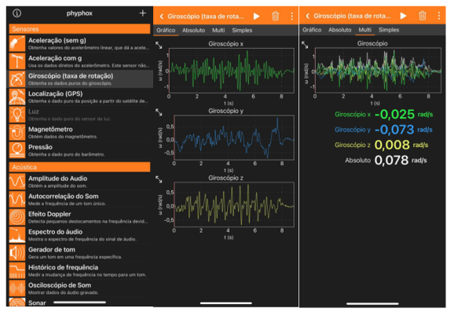

# 1 - RESUMO

Introdução: É de conhecimento geral que disfunções em membros superiores acometem a
função e a qualidade de vida dos indivíduos afetados. São de grande importância instrumentos
de avaliação dos membros superiores para a melhora da prática clínica e na avaliação da
eficácia das intervenções de reabilitação. Objetivos: Avaliar a validade e confiabilidade do
método de avaliação funcional para MS utilizando o giroscópio em indivíduos com sintomas
no ombro e cotovelo e verificar se existe correlação entre os membros dominante e não
dominante. Métodos: Trata-se de uma pesquisa observacional com desenho de estudo
transversal, que será realizada no Laboratório de Avaliação e Reabilitação do Aparelho
Locomotor (LARAL) da Universidade Federal de Santa Catarina, Campus Araranguá. Será
realizada a validade e confiabilidade de um instrumento de avaliação que avaliará os
movimentos angulares do membro superior durante um percurso de 5 metros. Para a
avaliação, será utilizado um giroscópio contido no aplicativo Phypox, que irá identificar os
ângulos X, Y e Z dos membros superiores. O participante irá segurar um celular smartphone
no membro superior dominante, com o cotovelo fletido a 90 graus e o ombro em neutro. O
avaliador irá ativar o giroscópio, que mostrará a variação dos valores dos ângulos X, Y e Z
durante toda a execução do trajeto. Participarão do projeto uma amostra por conveniência de
50 participantes sintomáticos dos segmentos ombro e cotovelo, para a análise da validade e
confiabilidade (intra examinador, teste e reteste) dos dados dos participantes. Como análise
estatística, os dados serão observados quanto à normalidade dos dados obtidos e escolhido o
método estatístico adequado conforme os dados sejam normais ou não. Após a obtenção das
variáveis de interesse, será realizada a análise descritiva e a correlação dos dados utilizando o
software SPSS para Windows.
Palavras chaves: Extremidade Superior; Análise de Variância; Reprodutibilidade dos Testes;
Estudo de Validação.

# 2 - INTRODUÇÃO

É de conhecimento geral que o acometimento nos membros superiores afeta a função e
a qualidade de vida dos indivíduos (Moraes et al., 2020). Funções específicas dos membros
superiores (MS), como preensão palmar, alcance e manipulação de objetos, estão presentes
em grande parte das atividades de vida diárias (AVD) e atividades ocupacionais, tendo
significativa participação no cotidiano dos indivíduos. Esses indivíduos que apresentam
algum acometimento nos MS podem apresentar alguns sintomas como: dor, incapacidade,
rigidez articular, mobilidade limitada, perda de funcionalidade e redução da força muscular,
afetando diretamente a participação em tarefas que necessitam dos MS funcionais (Harris;
Eng., 2007; Cavaco; Alouche, 2010; Balbi et al., 2019).
Esses sintomas podem comprometer a harmonia dos movimentos dos MS, que é
dependente da função dos segmentos existentes. Dentre estes segmentos estão o ombro,
braço, antebraço e mão. O ombro é uma articulação complexa e a mais móvel do corpo,
porém também é considerada pouco estável (Metsker, 2010). De acordo com Leotty, Lima e
Araujo (2020), “desordens no complexo do ombro são uma das causas mais comuns de
distúrbios musculoesqueléticos, tendo a incidência de dor no ombro sendo inferior apenas à
da dor lombar, afetando entre 16% e 21% da população e alcançando de 7 a 25 a cada mil
consultas de clínica geral por ano”. O cotovelo também é uma articulação complexa, porém,
de acordo com a dor e a função, é possível identificar o local da lesão mais facilmente que o
ombro (Kane; Lynch; Taylor, 2014).
As disfunções musculoesqueléticas (DME) incluem uma gama de condições
inflamatórias ou degenerativas e alterações biomecânicas que podem impactar nervos,
ligamentos, tendões, articulações, músculos e vasos sanguíneos em diferentes segmentos dos
MS (Punett et al., 2004). DME vem sendo um dos principais fatores que contribuem para a
incapacidade para trabalhar na população ativa, tanto em países desenvolvidos quanto em
desenvolvimento (Nambiema et al., 2020).
A avaliação dos MS é fundamental para diagnóstico médico e reabilitação
fisioterapêutica de possíveis DME, além da melhora da prática clínica e na avaliação da
eficácia das intervenções de reabilitação. As avaliações dos MS podem ser aplicadas a
populações com problemas neurológicos, neuromusculares ou traumato-ortopédicos
(Satisteban et al., 2016). Esses recursos de avaliação ajudam a avaliar o grau de
comprometimento do paciente em vários aspectos, incluindo capacidade funcional e funções
sensório-motoras (Cavaco; Alouche, 2010).
Atualmente, cada segmento corporal possui ferramentas de avaliação específicas. Na
avaliação do ombro, temos o questionário Shoulder Pain and Disability Index (SPADI), que é
direcionado para disfunções nessa articulação e tem como propósito identificar as
incapacidades presentes nesta região (Martins et al., 2010). Temos também o questionário
Constant-Murley Score (CMS), também de avaliação do ombro, que avalia questões como
dor, atividade de vida diária, amplitude de movimento e potência (Barreto et al., 2016). Além
desses questionários, temos a escala UCLA (Escala de avaliação do ombro modificada) que
quantifica a dor no ombro durante atividades que necessitam do seu uso (Oku et al., 2006).
Quanto à avaliação do cotovelo, temos a escala Patient-rated Tennis Elbow Evaluation
(PRTEE), que foi desenvolvida para avaliar pacientes com epicondilite lateral, quantificar a
dor e a funcionalidade do cotovelo durante as AVDs (Ikemoto et al., 2020). Além dos
instrumentos específicos para cada segmento, temos instrumentos que abrangem todo o
membro superior, como o questionário Patient Reported Outcome Measure (PROM) e a
escala Patient Specific Functional Scale (PSFS), que avaliam as limitações. Além deles,
temos o questionário Disabilities of the Arm, Shoulder, and Hand (DASH) e sua versão
reduzida, o QuickDASH. O Questionário DASH, que será utilizado neste estudo, foi
elaborado em 1994, com o objetivo de medir os efeitos dos vários distúrbios que acometem os
membros superiores. Esse questionário é utilizado para a avaliação de qualquer condição
músculo esquelética da extremidade superior, tendo potencial de ampla aplicabilidade e
permitindo comparações entre diferentes condições dos membros superiores (Hudak;
Amadio; Bombardier 1996; Moraes et al., 2020).
Para a avaliação funcional, existem também testes funcionais, como o Closed Kinetic
Chain Upper Extremity Stability Test (CKCUEST) e o Y Balance Test, que são utilizados para
analisar gestos biomecânicos e a estabilidade da extremidade superior, permitindo assim
identificar assimetrias e desequilíbrios funcionais no indivíduo (Hollstadt; Boland ;
Mullingan, 2020; Verlade, 2021). Além destes instrumentos de avaliação, temos outras formas
mais tecnológicas de avaliação, como a utilização de acelerômetros, giroscópios e sensores
para identificar movimentos executados com mais precisão. Por exemplo, são analisados os
três eixos espaciais, que são frequentemente utilizados por serem rotacionais e
perpendiculares (Grood; Suntay, 1983).
Diante das diversas formas de instrumentos de avaliação presentes na literatura, é
necessário, segundo Rósen; Lundborg (2003), que as avaliações atendam a algumas medidas
psicométricas e científicas. Para ser qualificado como um instrumento de avaliação.
padronizado, deve haver documentações que comprovem: finalidade, validade,
confiabilidade, descrição detalhada, dados normativos e instruções de uso.
Após o desenvolvimento de um novo instrumento, é necessário que o mesmo possua
credibilidade e confiança, que é algo fidedigno e replicável (Nora et al., 2017). Avaliações.
válidas e confiáveis são cruciais para obter uma melhor compreensão da situação e sintomas
do indivíduo (David et al., 2021).
Para que seja realizada a validação de forma apropriada, é necessário que se tenha uma
definição clara do construto que o instrumento irá medir (Souza; Alexandre; Guirardello,
2017). A validação se refere à capacidade do instrumento realizar aquilo a que se propõe sem
o risco de viés, sendo o viés um erro durante a realização do estudo que pode comprometer a
conclusão da pesquisa (Ribeiro; Cardoso, 2009). Grande parte dos estudos de validação
realizados no Brasil são realizados ou criados no exterior e, posteriormente, os pesquisadores
ficam responsáveis por realizar a tradução, validação e confiabilidade do instrumento para o
país a ser utilizado (Nora et al., 2017).
Quanto à confiabilidade, se refere à medida utilizada no estudo e à sua capacidade de
obter os mesmos resultados ao longo do tempo quando repetida. Ela é fundamental, pois
garante a qualidade e o significado dos dados de um estudo (Balbi et al., 2019; Brito et al.,
2023; Pereira; Gomes, 2003).
Para se avaliar a confiabilidade de um estudo, pode-se utilizar diversos métodos
estatísticos, como por exemplo o teste e reteste, onde é utilizada a mesma medida em dois
momentos diferentes (Souza; Alexandre; Guirardello, 2017) ou a avaliação intra e
interexaminadores. A avaliação intraexaminador consiste na medição do mesmo instrumento
em diferentes momentos e a avaliação interexaminadores se refere à concordância entre a
avaliação de dois ou mais avaliadores (Ramalho et al., 2021).
O uso de smartphones vem sendo cada dia mais utilizado para diversos meios. Esses
aparelhos atualmente podem baixar aplicativos com medidores embutidos como
acelerômetros, giroscópios e magnetômetros, podendo ser utilizados para avaliar o balanço
corporal, precisão, taxa de angulação, aceleração linear e rotacional do corpo e seus eixos
(Antonio; Teruya; Mochizuki, 2020).
Segundo o estudo de Antonio; Teruya; Mochizuki (2020), o uso de acelerômetros tem
proporcionado a descrição sobre os padrões de atividade física e comportamentos sedentários,
o que permite associá-los ao nível de aptidão física e saúde das pessoas, ademais, verificar a
eficácia de intervenções para influenciar positivamente a prática de atividade física.
O uso de um giroscópio para avaliar um objeto é feito medindo sua taxa de rotação.
angular em relação a um eixo específico. O giroscópio utilizado em smartphones costuma
conter três eixos e sensores inerciais para que seja possível realizar uma coleta de dados sobre
a orientação, equilíbrio e rotação do corpo durante a atividade física (Antonio; Teruya;
Mochizuki, 2020), porém a literatura é escassa quanto à utilização de giroscópios e
acelerômetros na avaliação de membros superiores. Através do exposto, o presente estudo
evidência as seguintes perguntas: a forma de avaliação funcional com utilização do giroscópio
em pacientes com sintomas em membros superiores é válida e confiável? Além disso, existirá
correlação entre o membro dominante e o não dominante?

# 3 - JUSTIFICATIVA

Como o método de avaliação de MS com giroscópio e acelerômetro ainda está em
desenvolvimento e em teste, é de extrema relevância um estudo de validação e confiabilidade.
Sendo necessário analisar se esse novo método de avaliação é confiável e aplicável não só em
indivíduos saudáveis, mas também em indivíduos que apresentem sintomas nos membros
superiores.

# 4 - HIPÓTESE

Espera-se, através desse estudo, chegar ao resultado de que esta forma de avaliação é
válida e confiável para ser realizada em pessoas com sintomas no ombro e cotovelo. Também
acredita-se que existirá correlação entre os membros dominante e não dominante.

# 5 - OBJETIVO GERAL

Avaliar a validade e confiabilidade do método de avaliação funcional para MS
utilizando o giroscópio em indivíduos com sintomas no ombro e cotovelo.

# 6 - OBJETIVOS ESPECÍFICOS

● Avaliar através do uso do giroscópio a instabilidade dos ângulos X, Y e Z durante uma
caminhada de 5 metros com uso do aplicativo Phyphox
● Verificar se há correlação entre o membro dominante e não dominante
● Investigar os sintomas e a função nos participantes com disfunções músculo
esqueléticas através do questionário DASH e teste de cadeia cinética fechada
● Analisar a confiabilidade através do teste e reteste

# 7 - MÉTODOS

## 7.1 - TIPO DE ESTUDO

Trata-se de uma pesquisa observacional com desenho de estudo transversal, que será
enviada para aprovação do Comitê de Ética em Pesquisa Clínica da Universidade Federal de
Santa Catarina. Os estudos transversais se tratam de estudos onde se observam e analisam os
dados de um único momento, não acompanhando os participantes ao longo do tempo (Setia,
2016). Esse estudo será realizado de acordo com o checklist COSMIN (Consensus based
Standards for the Selection of the Health Measurement Instruments).

## 7.2 - LOCAL DO ESTUDO

Os procedimentos relacionados ao projeto serão realizados no Laboratório de
Avaliação e Reabilitação do Aparelho Locomotor (LARAL) da Universidade Federal de Santa
Catarina, Campus Araranguá. Araranguá fica localizado no extremo sul de Santa Catarina,
tendo população residente de 71.922 e PIB per capita de 34.317,67, segundo o IBGE (2022 e
2021) respectivamente.

## 7.3 - PARTICIPANTES

Participarão do projeto uma amostra por conveniência de 50 participantes que,
inicialmente, serão informados sobre como a pesquisa será realizada e irão assinar o TCLE.
Será realizada uma coleta independente de 50 participantes com idade entre 18 e 50 anos,
sintomáticos do segmento do ombro e da articulação do cotovelo, para a análise da validade e
confiabilidade (intra examinador e teste e reteste) dos dados dos participantes.

### 7.3.1 - Critérios de Inclusão e Exclusão
Como critérios de inclusão, serão adultos com idade entre 18 a 50 anos, ambos os
sexos, que residam no extremo sul de Santa Catarina e apresentem sintomas no ombro ou
cotovelo. Como critérios de exclusão destacamos: gestantes, situações clínicas do indivíduo
que impeçam a comunicação adequada, declínio cognitivo, fraturas em membros inferiores e
dificuldades de locomoção.

## 7.4 - VIÉS

Para reduzir o risco de viés de tempo, a coleta de dados do teste e re-teste será
realizada em um período de uma semana. Até o presente momento, não foram verificados
nenhum possível viés no aplicativo Phypox.

## 7.5 - PROCEDIMENTO DE COLETA DE DADOS

Os participantes serão recrutados pelo Laboratório de Avaliação e Reabilitação do
Aparelho Locomotor (LARAL), que será realizado através de divulgação em folders,
publicações em redes sociais e nas rádios locais. Antes do procedimento da coleta de dados,
todos os participantes irão responder um breve questionário para seleção dos participantes de
acordo com os critérios de inclusão e exclusão.
Após a realização do questionário, será realizada avaliação clínica padrão, contendo as
seguintes informações: idade, peso, altura, IMC, anamnese, a utilização do questionário
DASH e o teste de cadeia cinética fechada, onde serão avaliados os sintomas e a
funcionalidade músculo esquelética dos MS (Anexo A). O questionário DASH foi proposto
por Hudak, Amadio e Bombardier (1996) e traduzido e validado por Orfale (2003).
Após a realização da avaliação clínica padrão e da realização do questionário, será
realizada a avaliação funcional dos membros superiores. Os dados serão coletados no período
entre março de 2025 e junho de 2025.
Todos os 50 participantes serão submetidos à avaliação funcional dos membros
superiores com o uso do giroscópio e acelerômetro, sendo esta uma tarefa padronizada
realizada por um avaliador previamente treinado (avaliação intraexaminador) e sendo repetido
no período de uma semana (teste e reteste). Durante este método de avaliação funcional, os
participantes caminharão um trajeto de 5 metros em linha reta, deambulando normalmente, o
membro superior será posicionado com o ombro neutro, cotovelo fletido a 90 graus e
antebraço em neutro. Será preconizado que o participante segure um smartphone. Caso o
voluntário não consiga realizar a preensão palmar, o smartphone será fixado no punho. O
celular já estará programado para ativação do giroscópio através do aplicativo Phyphox, que
será pré-programado para obter a angulação nos três eixos (X, Y, e Z) do MS. Será realizado o
teste em ambos os membros superiores, primeiramente sendo realizado o teste no membro
dominante e em seguida sendo realizado o teste no membro não dominante.
Após a realização do teste, todos os dados coletados serão planilhados no software
Excel, onde será realizada análise dos dados através da equação, para obtenção da razão entre
os dois membros avaliados. Será realizada uma análise inicial e a análise será repetida em um
período de uma semana após a primeira.

## 7.6 - ANÁLISE ESTATÍSTICA

Após a obtenção das variáveis de interesse, será realizada a análise descritiva e a
correlação dos dados utilizando o software SPSS para Windows (Statistical Package for the
Social Sciences). Será observada a normalidade dos dados obtidos e escolhido o método
estatístico adequado conforme os dados sejam normais ou não.

# 8 - APLICATIVO PHYPOX

O uso do aplicativo será através de um smartphone (modelo, marca, a definir) com o
aplicativo Phyphox instalado previamente. O aplicativo Phypox, que é um aplicativo de
download gratuito, permitindo aos usuários utilizarem ferramentas como o acelerômetro e o
giroscópio. O Phyphox utiliza os eixos anatômicos X, Y e Z para observar a posição e o
direcionamento do movimento do segmento avaliado (figura 1). Logo, o acelerômetro
identifica a aceleração em que o corpo se encontra em relação à gravidade, e o giroscópio
será o sensor necessário para interpretação da localização de um determinado objeto no
espaço, identificando sua posição e mostrando isso por meio de gráficos e números (O’reilly,
Weinberg, 2010; Antonio; Teruya; Mochizuki, 2020).
Durante a aplicação da avaliação funcional do membro superior, o indivíduo irá
segurar o celular smartphone. Em caso de déficit de preensão palmar, será fixado no punho, o
cotovelo estará fletido a 90 graus e será ativada a função de aceleração e giroscópio, assim
sendo possível identificar durante toda a execução da avaliação as oscilações nos eixos X, Y e
Z presentes durante o percurso de 5 metros em linha reta. O percurso será sinalizado com
cones para identificar a distância para, posteriormente, serem avaliadas. Após a realização do
teste, os dados obtidos pelo aplicativo serão transportados para a planilha Excel, para ser
realizada a análise da variação da aceleração linear nos eixos a serem examinados.

  
   
  <em>Fig 1: Imagem representativa do aplicativo Phyphox, fonte do autor.</em>

# 8.1 EQUAÇÃO

Ms = (X1+ X2 + X3 +....+Xn) / N

Ms - Média aritmética do somatório da velocidade média angular de cada ponto medido pelo
sensor durante o tempo do experimento.
X1 - Primeira medição de velocidade angular, e assim consecutivamente
n - É o número de medições feitas pelo sensor durante todo o experimento.

O resultado da média aritmética das velocidades angulares medidas em todos os
pontos pelo sensor define o quanto aquele membro se movimentou durante o experimento.
Quanto mais próximo de zero o resultado, menores foram as variações ocorridas naquele
membro, por consequência, mais estável.

# 9 - ASPECTOS ÉTICOS

O projeto ainda será enviado para aprovação do Comitê de Ética. Antes de iniciar os
procedimentos e avaliações, serão passadas todas as informações sobre os procedimentos a
serem realizados com os participantes, sendo esclarecido sobre o TCLE o quão deverão
assinar. No decorrer de todas as fases do projeto, serão seguidas as diretrizes e normas
reguladoras da pesquisa que envolve seres humanos, através da resolução 466/2012.

# 10 - RESULTADOS ESPERADOS

Espera-se, com a realização da avaliação intra examinador e do teste e reteste da
avaliação no período de 7 dias, que seja possível analisar se essa forma de avaliação dos
membros superiores em pacientes sintomáticos (ombro e cotovelo) é válida e confiável, e se
vai haver correlação entre os membros dominante e não dominante.